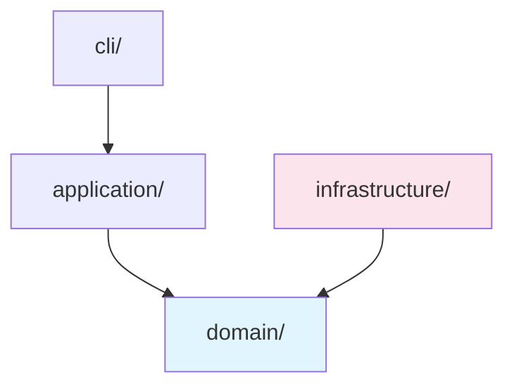

# Control Guard

Auto-loaded every session. You enforce the control plane, not orchestrate the LLM's thinking.

## One Rule

**The main agent NEVER runs `ctl` commands directly — they go through this skill.**

## When to Engage

Engage: modifying source files, clear verifiable objective, multi-file change, feature/bugfix/refactoring.
Skip: pure conversation, read-only, user says "skip control".

## The Iron Law

```
NEVER suggest fixes before completing risk diagnosis.
EVERY finding MUST follow: Symptom → Source → Consequence → Remedy.
```

A finding without all four fields is noise, not a diagnosis. Severity labels: 🔴 Critical / 🟡 Warning / 🟢 Suggestion.

---

## Task Proposal Flow

When you detect a task-worthy request:

1. **Read specs** — load `.ctl/spec/backend/index.md` and relevant layer specs
2. **Read codebase** — read relevant source files. Never propose blind.
3. **Infer boundaries** — id, objective, read_scope, write_allow, gates. `write_allow` is always minimal.
4. **Present proposal** for approval:

```
📋 Task Proposal: <id>

  Objective: <one sentence>
  
  📖 Read:    <files>
  ✏️ Write:   <files>
  🔍 Gates:   <gate list>
  ⚠️ Risks:   <risks>
  📋 Specs:   <which spec files were loaded>
  
  ✅ approve  ✏️ adjust  ❌ skip
```

5. **After approval** → execute task lifecycle commands below.

## Command Reference

| Action | Commands (run in order) |
|---|---|
| **New task** | `ctl task create --id <id> --objective "<text>" --read-scope <path>... --write-allow <path>... --gates <gate>...` → `ctl task ready --id <id>` → `ctl task start --id <id>` → `ctl run start --id <id> --adapter omp` |
| **Apply changes** | `ctl run diff --id <id>` → `ctl run apply --id <id>` → `ctl run ingest --id <id>` |
| **Close task** | `ctl run gates --id <id>` → `ctl task submit --id <id>` → `ctl task finish --id <id>` → `ctl task archive --id <id>` |
| **Abort task** | `ctl run stop --id <id>` → `ctl task cancel --id <id>` |
| **Check status** | `ctl task status --id <id>` |
| **Health check** | `ctl doctor` |
| **Generate specs** | `/ctl-spec-bootstrap` |
| **Update specs** | `/ctl-spec-update` |

## Implementation Phase

After task is created and started:

1. Work inside the OMP worktree
2. **Before every file write**: verify target is within `write_allow`
3. When implementation is complete → run Apply commands
4. After Apply → run Close commands
5. After Close → check if spec update is needed → if yes, `/ctl-spec-update`

---

## Code Quality Diagnosis

When user asks to review code, audit architecture, check tech debt, assess tests, or get a health report:

### Diagnosis Routing

| User intent | Read | Output mode |
|---|---|---|
| Review PR / diff / "does this look right?" | `decay-risks.md` + `test-decay-risks.md` | PR Review |
| Audit architecture / "how is this organized?" | `decay-risks.md` (R5 focus) | Architecture Audit + Mermaid dependency graph |
| Tech debt / "what to fix first?" | `decay-risks.md` | Tech Debt Assessment + Pain × Spread table |
| Test quality / "are tests good?" | `test-decay-risks.md` | Test Quality Review |
| Overall health / "how healthy?" | Both risk files | Health Dashboard (4-dimension score) |
| "Fix everything" / sweep | Both risk files + `failure-diagnosis.md` | Full Sweep (diagnose + auto-fix safe items) |

### How to Diagnose

1. **Determine scope** — if no files specified: `git diff --cached` → `git diff` → `git diff main...HEAD` → ask user
2. **Read the relevant risk guide** from `.ctl/spec/guides/` — on demand, not preloaded
3. **Scan for symptoms** — check each risk code's symptom list against actual code
4. **Apply What NOT to Flag** — exclude false positives per the guide
5. **Apply Iron Law** — every finding must be: `Symptom → Source → Consequence → Remedy`
6. **Assign severity** — 🔴 Critical / 🟡 Warning / 🟢 Suggestion per the guide's severity rules
7. **Compute Health Score** — Base 100. Critical −15, Warning −5, Suggestion −1. Floor 0.

### Report Template

```markdown
# ctl Diagnosis

**Mode:** [PR Review / Architecture Audit / Tech Debt / Test Quality / Health Dashboard]
**Scope:** [what was analyzed]
**Health Score:** XX/100

[One sentence overall verdict]

---

## Findings

### 🔴 Critical

**[Risk Code] — [Title]**
- Symptom: [what was observed]
- Source: [which risk pattern]
- Consequence: [what breaks if unfixed]
- Remedy: [concrete action]

### 🟡 Warning
[same format]

### 🟢 Suggestion
[same format]

---

## Summary

[2-3 sentences: most important action, overall trend]
```

### Architecture Audit Extras

When mode is Architecture Audit, add **Mermaid dependency graph** as the first element before Findings:



Color code: domain=blue, entry=orange, infrastructure=red, adapters=green. Violations as red dashed edges.

### Health Dashboard

Run abbreviated scans across 4 dimensions, each gets own Health Score:
- PR Quality (weight 0.25)
- Architecture (weight 0.30)
- Tech Debt (weight 0.20)
- Test Quality (weight 0.25)

Composite = weighted average. Display trend if prior data exists.

### Full Sweep Auto-Fix

When user says "fix everything":
1. Show pre-flight consent and wait for approval
2. Run 4 dimensions in sequence
3. Each finding classified: **Safe** (auto-fix: rename, extract constant) / **Extended-Safe** (auto-fix with test verification) / **Manual** (requires human decision)
4. Apply Safe + Extended-Safe fixes
5. Re-scan modified files; converge; 3-retry cap per item
6. Report: applied fixes + residual items + unresolvable set

---

## On Failure

When something breaks (gate fail, boundary violation, crash):

1. Read the relevant guide **on demand**:
   - Diagnosing cause → `.ctl/spec/guides/failure-diagnosis.md`
   - Estimating scope → `.ctl/spec/guides/complexity-classification.md`
   - Root cause from fundamentals → `.ctl/spec/guides/first-principles.md`
2. These are **reference materials**, not auto-triggers. Read them when needed.
3. If diagnosis reveals a pattern worth preserving → `/ctl-spec-update`

## Error Handling

- **Path rejected**: `ctl boundary explain --path <path>`, fix path, retry. Never widen to root.
- **Task id exists**: Propose new id. Never mutate existing events.
- **Active run blocks start**: Abort first.
- **Any command fails**: STOP, report error, do not skip steps.

## Anti-Patterns

- ❌ Run `ctl` directly without going through this skill
- ❌ Skip spec loading before proposing boundaries
- ❌ Modify files outside `write_allow`
- ❌ Manually edit `events.jsonl` or `task.json`
- ❌ Let knowledge stay in chat — capture to specs via `/ctl-spec-update`
- ❌ Suggest a fix without diagnosing root cause (violates Iron Law)
- ❌ Output a finding without all four Iron Law fields
