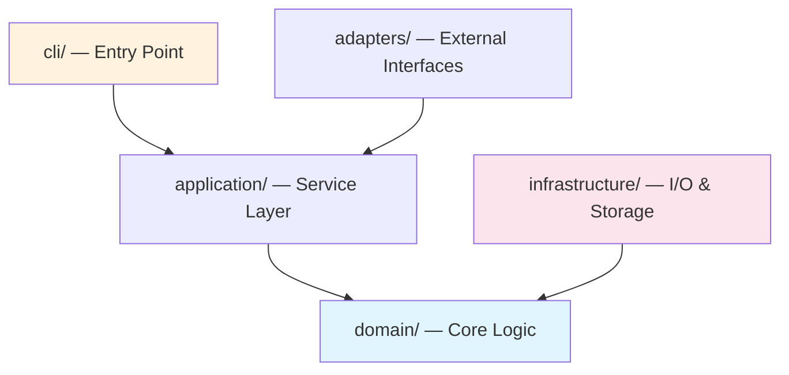
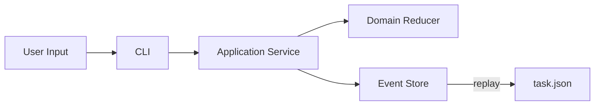
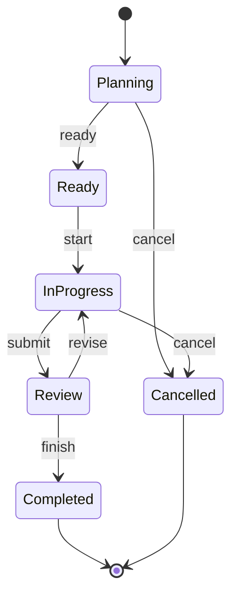

# /ctl-spec-bootstrap — Migrate Existing Workflow, then Generate Project Specs

This skill has two parts, run in order:

- **Part 1 — Migration** (first run only): detect and inventory an existing agent workflow (`CLAUDE.md`, `AGENTS.md`, `.trellis/`, prior `.ctl/spec/`), install the ctl-managed `CLAUDE.md` block without overwriting user content, and safely handle a legacy `.trellis/` workspace (keep / import-then-archive / ignore). Makes `ctl` the single active control plane without destroying what the user already has.
- **Part 2 — Generation**: analyze the real codebase and produce `.ctl/spec/` documentation with concrete patterns, architecture diagrams (Mermaid), directory trees, file paths, conventions, and anti-patterns extracted from source.

**Run when**:
- Introducing `ctl` to a project (`ctl init` already ran) — do Part 1, then Part 2
- After significant refactoring that invalidates existing specs — Part 2 (Part 1 is idempotent / a no-op once migrated)
- User explicitly requests `/ctl-spec-bootstrap`
- Hook detects spec drift (specs stale relative to code changes) — Part 2

**Supports**: Rust, TypeScript/JavaScript (frontend + Node), Java (Maven/Gradle), Go, Python, and mixed-language projects.

> Scope: this skill writes only under `.ctl/`, `.trellis(.bak)/`, `.omp/`, `CLAUDE.md`, `AGENTS.md`. It never edits project source. See "Operating boundary" below.

---

## Operating boundary (read this first)

This skill may **create, modify, rename, or archive files ONLY** under:

- `.ctl/` — canonical ctl state and imports
- `.trellis/` and its archive `.trellis.bak*` — legacy workspace
- `.omp/` — control-plane skills, hooks, settings
- `CLAUDE.md` and `AGENTS.md` — agent entry / rule files

**Never modify project source code, build manifests, CI config, or anything else** during bootstrap or migration. Reading any file is fine; writing is restricted to the paths above. If a step appears to need a source edit, stop and report it instead — do not do it.

---

# Part 1 — First-run migration of an existing agent workflow

Run Part 1 **before** generating specs, the first time `ctl` is introduced to a repo that already has agent tooling: an existing `CLAUDE.md`, `AGENTS.md`, `.trellis/`, or a pre-existing `.ctl/spec/`. If none of those exist (a clean repo), skip directly to Part 2.

Goal: make `ctl` the single active control plane **without** destroying or silently overriding what the user already has.

### Enforcement level

This migration workflow is implemented as agent-readable guidance.

The skill instructs the agent to inventory first, request explicit user
confirmation, preserve existing content, and avoid destructive migration.
These rules are not independently enforced by the ctl binary in v0.0.2.

Any claim such as "refuse", "must not", or "fail closed" in this section
describes required agent behavior, not a machine-enforced security boundary.

## Migration principles (do not violate)

```
existing content is user-owned       -> never overwrite a whole user file
managed content is ctl-owned         -> only edit inside ctl markers
files may coexist                    -> keeping/copying both is fine
authority may not coexist            -> exactly one ACTIVE control plane (ctl)
importing does not grant trust       -> imported content stays L0
```

Operational consequences — each is mandatory:

- Never overwrite `CLAUDE.md` / `AGENTS.md` wholesale; edit only the ctl-managed block.
- Never delete `.trellis/`; archive it by **rename only**.
- Never silently pick a winner when two rules conflict; report the conflict.
- Never convert Trellis tasks / history into ctl canonical events.
- Never claim imported Trellis specs are source-verified facts (they are L0).
- Always proceed **inventory → plan → confirm → execute**, in that order.
- Never change control-plane authority without explicit user confirmation.

## M1 — Inventory (read-only; make NO writes in this step)

Detect and record what exists. Do not modify anything yet.

| Target | What to inventory |
|---|---|
| `CLAUDE.md` | present? contains a `ctl:managed` block? are its markers well-formed? |
| `AGENTS.md` | present? foreign managed blocks (e.g. `<!-- TRELLIS:START -->`)? rules that duplicate or contradict the ctl block? |
| `.trellis/` | spec files, task dirs, workspace/memory, workflow/config, hooks/scripts; git tracked / modified / untracked / ignored; hard-coded `.trellis/` references elsewhere |
| `.ctl/spec/` | already present? If so, this run is a **refresh** — never overwrite existing files. |

Commands (PowerShell first; POSIX equivalents in comments):

```powershell
Test-Path CLAUDE.md, AGENTS.md, .trellis, .ctl\spec

# Trellis git state (what would be lost if someone deleted it):
git ls-files .trellis                       # tracked
git status --porcelain --ignored .trellis   # modified / untracked / ignored

# Hard-coded references to .trellis across surfaces we may touch + common config:
git grep -n -- ".trellis" -- CLAUDE.md AGENTS.md .omp .claude README.md CONTRIBUTING.md package.json .github
#   POSIX: grep -rn ".trellis" CLAUDE.md AGENTS.md .omp .claude README.md CONTRIBUTING.md package.json .github
```

Classify every rule/spec you read by **source** — do not treat all text as equal fact:

```
observed_fact        Cargo.toml, CI workflow, source layout, real test commands, deps
declared_rule        CLAUDE.md, AGENTS.md, .trellis/spec, README, workflow docs
generated_synthesis  .ctl/spec/index.md and other bootstrap output
legacy_history       .trellis/tasks, task state, execution / gate history
```

If a `declared_rule` contradicts an `observed_fact`, do **not** silently resolve it. List it under `DECLARED / OBSERVED CONFLICT` in the final report. V1 only **reports** conflicts; do not create new uncertainty/epistemic records for the migration.

## M2 — CLAUDE.md: the ctl managed block

`ctl` owns exactly one block, delimited by these exact markers:

```
<!-- ctl:managed:start -->
... ctl-owned content ...
<!-- ctl:managed:end -->
```

Decision rules (apply in order):

1. **Exactly one well-formed pair exists** (one start, one end, start before end): replace only the text between and including the markers with the fresh managed content. Everything outside is preserved byte-for-byte. This is the idempotent refresh path.
2. **No block, but the file exists**: append one managed block at the end, separated by a blank line. Preserve all existing content. Never add a second block.
3. **No file**: create a thin `CLAUDE.md` whose body is only the managed block. **Never** paste full `.ctl/spec` content into `CLAUDE.md`.
4. **Idempotent**: re-running must not add a second block or alter user content.
5. **Corrupt markers** — any of: a start with no end, an end with no start, end-before-start, or more than one of either — **refuse to modify**. Print a precise error naming the defect and stop. **Never guess a repair.**

Managed block content (paste verbatim; you may substitute the project name in prose, keep it thin):

```markdown
<!-- ctl:managed:start -->
## ctl workflow

This repository uses `ctl` as its canonical task and evidence control plane.

Before modifying files:

1. Read `AGENTS.md` when present and the relevant documents under `.ctl/spec/`.
2. Inspect the current ctl task and write scope.
3. If no suitable task exists:
   - use brainstorm for ambiguous or multi-option work;
   - create a scoped ctl task;
   - move it through ready/start before writing.
4. Only modify paths allowed by the active task.
5. Protected-path changes must use ctl apply/approval.
6. Do not manually edit canonical ctl event ledgers or bypass enforcement hooks.

During work:

- Use OMP todos for temporary implementation steps.
- Use ctl tasks for durable scope, gates and lifecycle.
- Record brainstorm, research, uncertainty and evidence provenance when applicable.
- Treat model and critic claims as advisory unless supported by an appropriate oracle.

Subagent dispatch (read-only by default):

- Dispatch **read-only** work — investigation, broad search, research, codebase
  questions — to read-only subagents (built-in `Explore`; `claude-code-guide` for
  Claude Code / SDK / API questions). They preserve main-agent context and cannot
  break scope because they never write.
- Keep **writes inline** in the main agent. Only the main agent reliably carries
  the active task's `CTL_TASK_ID` binding and routes its Write/Edit/Bash through
  the ctl gate. Do **not** dispatch file edits to subagents: a subagent runs in an
  isolated context, does not inherit `CTL_TASK_ID`, and it is unverified whether
  its tool calls reach the PreToolUse gate at all.

Before completion:

1. Commit the final changes.
2. Run all required gates against the committed tree.
3. Submit for review.
4. Record a fresh completion audit.
5. Run `ctl task finish`.
6. Do not modify the repository after finish without opening or revising a task.

Canonical control state lives under `.ctl/`.
Legacy workflow directories such as `.trellis/` are not canonical ctl state.
<!-- ctl:managed:end -->
```

If `AGENTS.md` exists, keep **general** project rules there and let the `CLAUDE.md` managed block stay a thin Claude-Code + ctl entry pointer. V1 does **not** auto-refactor `AGENTS.md`; instead, report any duplicated/conflicting rules — including a foreign `TRELLIS`-managed block — in the final report so the user can reconcile them.

## M3 — `.trellis/`: ask, never assume

If `.trellis/` exists, present the M1 inventory, then ask the user (recommend option 2, but **never auto-select**):

```
Existing Trellis workspace detected.

1. Keep .trellis as legacy read-only
2. Import useful assets, then archive .trellis as .trellis.bak   (recommended)
3. Leave untouched and do not import
4. Cancel bootstrap
```

**Fail closed when non-interactive.** If you are running unattended (no one can answer the prompt) and no mode was supplied out-of-band, **stop**: do not import, do not archive. Print an error requiring an explicit choice. **Never default to archive** in CI or an unattended agent run.

### Mode 1 — Keep as legacy read-only
- Leave `.trellis/` in place; delete nothing.
- Write a migration manifest marking `authority: legacy`, `active_control_plane: false`.
- Detect and report Trellis hooks/workflows that may still be active; do **not** silently disable them unless the user explicitly confirms.
- The `CLAUDE.md` managed block must state that `.trellis/` is not canonical ctl state.

### Mode 2 — Import then archive (strict order — never reorder)
```
inventory
-> build import plan
-> import selected content
-> verify destination hashes
-> disable/rewrite conflicting ACTIVE references (see M5)
-> user confirmation
-> rename .trellis to backup (see M4)
-> final verification
```
**Never rename before importing.**

### Mode 3 — Leave untouched
- Do not import, do not rename, do not modify Trellis hooks.
- Only note the potential dual-control-plane risk in the final report.

### Mode 4 — Cancel
- Produce **zero** file changes. Clean up any temp files already created. The operation must be atomic / safely retryable.

## M4 — Archiving `.trellis` -> `.trellis.bak` (rename = archive, not delete)

Only when the user chose Mode 2 (or explicitly asked to archive `.trellis`). Archiving moves the directory aside by rename; it never deletes data.

Preconditions (ALL required before renaming):
- `.trellis` exists and is a **directory at the repository root**;
- `.trellis` is not a symlink/junction, and the archive target stays inside the repo;
- the chosen target name does **not** already exist.

Collision-safe, deterministic target selection: try `.trellis.bak`, then `.trellis.bak.1`, `.trellis.bak.2`, … and use the first name that does not exist. (A timestamped name is acceptable only where a test can pin the timestamp.) Show the chosen path to the user and record it in the manifest.

Rename only — **never** copy-then-delete, **never** `rm -rf`:

```powershell
# verify, then rename atomically; on failure .trellis is left untouched
if (Test-Path .trellis.bak) { throw "target exists; pick .trellis.bak.N" }
Rename-Item -LiteralPath .trellis -NewName .trellis.bak
#   POSIX: [ -e .trellis.bak ] && exit 1; mv .trellis .trellis.bak   # mv = rename on same fs
```

If the rename fails, `.trellis` must remain exactly as it was. Ignored and untracked files are carried into the archive automatically, because a directory rename moves the whole tree.

## M5 — Active-reference handling (before archiving)

Search these surfaces for `.trellis/` references and classify each one:

```
CLAUDE.md  AGENTS.md  .omp/  .claude/  hooks  scripts  package.json  CI workflows  IDE config  README / CONTRIBUTING
```

- **active executable reference** (a hook path, an npm script, a CI step, a runnable command): must be **rewritten to the ctl entry point**, or explicitly kept by user choice. Otherwise **block the archive** and report the blocker — do not archive past an unhandled active reference.
- **documentation reference** (prose in a `.md`): may stay; annotate it with the legacy archive path.
- **historical reference** (changelog / notes describing past state): leave as-is.

Do not misclassify a prose mention in a doc as an active hook.

## M6 — Importing Trellis content (knowledge only; never control state)

Destinations:
```
.ctl/spec/imported/trellis/        <- copied knowledge assets
.ctl/imports/trellis/manifest.json <- provenance manifest
```

**Importable (knowledge):** `.trellis/spec/**`, workflow docs, architecture/convention docs, long-term knowledge Markdown in the workspace.

**Legacy-only (reference or copy, never promote):** `.trellis/tasks/**`, task state, execution history, session memory, Trellis completion/gate records. These may be copied or listed in the manifest, but must **never** become ctl canonical events (`task_created`, `task_completed`, `gate_checked`, `evidence_accepted`, …). Do **not** run any `ctl task …` / `ctl gate …` commands to replay imported history.

For every imported file: compute `sha256` of source and destination and assert they are equal; record both in the manifest. Imported content keeps trust level `content_l0` — never present it as source-verified.

```powershell
(Get-FileHash -Algorithm SHA256 .trellis\spec\backend.md).Hash    # compare to destination
#   POSIX: sha256sum .trellis/spec/backend.md
```

Manifest — stable-sorted by `source` so re-running bootstrap produces no spurious diff:

```json
{
  "provider": "trellis",
  "source_root": ".trellis",
  "archive_path": ".trellis.bak",
  "mode": "import_then_archive",
  "trust_level": "content_l0",
  "canonical_ctl_history": false,
  "active_control_plane": false,
  "files": [
    {
      "source": ".trellis/spec/backend.md",
      "destination": ".ctl/spec/imported/trellis/backend.md",
      "source_hash": "sha256:...",
      "destination_hash": "sha256:...",
      "classification": "declared_spec"
    }
  ],
  "legacy_tasks_imported_as_events": false
}
```

## M7 — Migration report (facts only — no pass/fail score)

```
CTL SPEC BOOTSTRAP

CLAUDE.md
  detected: yes/no
  ctl managed block: installed / updated / unchanged
  user-owned content preserved: yes

AGENTS.md
  detected: yes/no
  possible duplicated rules: N

TRELLIS
  detected: yes/no
  selected mode: keep / import_then_archive / ignore / cancel
  specs imported: N
  legacy tasks preserved: N
  canonical ctl events synthesized: 0
  active references rewritten: N
  archived_to: .trellis.bak(.N)

CTL
  spec root: .ctl/spec/
  active control plane: ctl
  manifest: .ctl/imports/trellis/manifest.json

CONFLICTS
  declared/observed conflicts: N
```

Emit the same facts as JSON if the caller asked for JSON output.

## Migration — must NOT do

- Convert Trellis tasks / history into ctl events.
- Bind a full PRD/Design, build a Web UI or project board, add authenticated principals or a hash chain.
- Auto-delete `.trellis`, or auto-resolve rule conflicts.
- Run `ctl` and Trellis as two active control planes at once.
- Promote imported content above L0.
- Touch project source code, build manifests, or CI config.

---

# Part 2 — Generate / refresh project specs from source

## Step 0: Verify prerequisites

```powershell
ctl doctor
```

If `.ctl/` doesn't exist, run `ctl init` first.
If `.ctl/spec/` already exists, read all existing files — this is a **refresh**, not overwrite.

## Step 1: Detect project type and language(s)

Read the root directory. Match marker files:

| Marker files | Language | Build / Package | Entry point |
|---|---|---|---|
| `Cargo.toml` | Rust | cargo | `src/main.rs` / `src/lib.rs` |
| `package.json` + `tsconfig.json` | TypeScript | npm/pnpm/yarn | `src/index.ts` |
| `package.json` (no tsconfig) | JavaScript | npm/pnpm/yarn | `src/index.js` / `index.js` |
| `pom.xml` | Java (Maven) | Maven | `src/main/java/.../Application.java` |
| `build.gradle` / `build.gradle.kts` | Java (Gradle) | Gradle | `src/main/java/.../Application.java` |
| `go.mod` | Go | go modules | `main.go` / `cmd/.../main.go` |
| `pyproject.toml` / `setup.py` / `setup.cfg` | Python | pip/poetry | `__main__.py` / `app.py` |
| `build.sbt` | Scala | sbt | `src/main/scala/...` |
| `mix.exs` | Elixir | mix | `lib/.../application.ex` |
| `Gemfile` | Ruby | bundler | `lib/.../rb` |
| `*.csproj` / `*.sln` | C# / .NET | dotnet | `Program.cs` |
| `vite.config.*` / `next.config.*` / `nuxt.config.*` | Frontend (SPA/SSR) | npm/pnpm/yarn | `src/main.tsx` / `pages/` / `app/` |
| `angular.json` | Angular | npm/ng | `src/main.ts` |
| `vue.config.*` | Vue | npm/vue-cli | `src/main.ts` |

**Mixed projects**: If multiple markers exist, treat each as a separate language module. Generate specs per language under `.ctl/spec/backend/`.

## Step 1.5: Determine and record the project default gate floor

The **project default gate floor** is the set of ctl gate templates that
`ctl task create` applies when a task omits `--gates`. It is a project-wide
safety floor — the gates every gate-less task in this repo must pass before it
can finish. ctl does **not** hardcode this floor; bootstrap derives it from the
analysis above and records it. Determine it once here, from the real project.

### Selection principle (not a fixed list)

The floor mirrors **what the project already enforces** — the checks its CI runs
and its tool configs require. Choose by what each gate catches, not by a
per-language template:

- **Always include correctness gates** — compilation/build and tests. A task
  that builds and passes tests is the minimum honest "done".
- **Include lint gates** — linters that flag defects (e.g. clippy), *when the
  project already uses them* (the CI runs them, or a lint config is present).
- **Include formatting gates** — formatting checks (e.g. `cargo fmt --check`)
  *when the project enforces formatting*: its CI runs the check, or it ships a
  fmt config. If the project does not enforce formatting anywhere, leave it out.

Use only gate IDs that exist as ctl gate templates. Today those are Rust-only:

| ctl gate template | Catches | In the floor? |
|---|---|---|
| `cargo_check` | compilation | yes (correctness) |
| `cargo_test` | test failures | yes (correctness) |
| `cargo_clippy` | lint defects | yes, **if** the project lints with clippy |
| `cargo_fmt_check` | formatting drift | yes, **if** the project enforces formatting |

For a Rust project whose CI runs `cargo fmt --check`, `cargo check`,
`cargo clippy`, and `cargo test`, the floor is therefore all four:
`cargo_check`, `cargo_test`, `cargo_clippy`, `cargo_fmt_check` — it mirrors the
gates CI already enforces.

**No applicable templates → leave it empty.** Detection by marker file does not
reliably classify every project (a `package.json` may be Node, a tool, or a
mixed repo). If the project's language has **no** ctl gate templates yet
(Node/TypeScript, Python, Go, Java, …), do **not** invent gate IDs. Leave
`default_gates` empty/absent; `ctl task create` will keep requiring an explicit
`--gates` for that repo until templates exist. A later, more capable bootstrap
fills these in.

### Record it in `.ctl/config.toml`

Write a `[project]` section (this path is inside the skill's operating boundary —
`.ctl/`). Example for this kind of Rust repo:

```toml
[project]
type = "rust"
default_gates = ["cargo_check", "cargo_test", "cargo_clippy", "cargo_fmt_check"]
```

Rules:

- **Validate before writing**: every ID in `default_gates` must be a real ctl
  gate template (the table above). Never write an ID ctl does not define.
- **Idempotent**: if `[project].default_gates` already exists and matches the
  analysis, leave it untouched. If it differs, this is likely a user-tuned floor
  — **report the difference and ask** before overwriting; do not silently
  replace it.
- **Empty is valid**: if no templates apply, omit `default_gates` (or write an
  empty list) rather than guessing.

## Step 2: Map architecture

### 2.1 Generate directory tree

Read the full directory tree (depth 4 for large projects, 5 for smaller ones). Skip:
- `node_modules/`, `target/`, `build/`, `dist/`, `.git/`, `__pycache__/`, `.gradle/`, `.idea/`, `.vs/`
- `vendor/`, `third_party/`, `.cache/`

**Output**: Write a file tree diagram with descriptions into `directory-structure.md`:

```
src/
├── cli/                    # CLI argument parsing, command dispatch
│   ├── mod.rs              # Command routing (clap derive)
│   └── ...
├── application/            # Business orchestration, validation
│   ├── mod.rs              # ControlApp service
│   └── ...
├── domain/                 # Pure domain logic (no I/O)
│   ├── task.rs             # TaskState + reducer
│   ├── event.rs            # Event definitions
│   └── ...
├── infrastructure/         # Side effects: storage, network, filesystem
│   ├── store/
│   ├── boundary/
│   └── ...
└── main.rs                 # Entry point
```

### 2.2 Detect layer boundaries

For each source directory, determine its architectural role:

| Role | Indicators (any language) |
|---|---|
| **Entry / CLI** | Argument parsing, command dispatch, `main()`, route handlers, `@Controller` |
| **Application / Service** | Business orchestration, validation, `@Service`, use cases, command handlers |
| **Domain / Core / Model** | Data types, entities, value objects, state machines, business rules, no I/O imports |
| **Infrastructure / Data** | Database repos, API clients, file I/O, `@Repository`, adapters, gateways |
| **Presentation / UI** | Components, views, templates, styles, `@Component`, `.vue`, `.tsx` (render) |
| **Shared / Utils** | Helpers, constants, types used across layers |

**Language-specific heuristics**:

| Language | Layer detection signals |
|---|---|
| **Rust** | `mod.rs` structure, `use crate::` imports, `impl` blocks |
| **TypeScript** | Barrel exports (`index.ts`), `import` paths, decorator annotations |
| **Java** | Package naming (`controller`, `service`, `repository`, `model`, `config`), Spring annotations |
| **Go** | Package naming (`handler`, `service`, `repository`, `model`), interface definitions |
| **Python** | Module naming, `__init__.py` exports, framework patterns (Flask/Django/FastAPI) |
| **Frontend** | `components/` → Presentation, `hooks/` or `composables/` → Logic, `api/` or `services/` → Data, `store/` → State |

### 2.3 Trace dependency direction

1. Read main module / barrel export files
2. Trace imports between directories
3. Map: which layer depends on which
4. **Flag violations** (e.g., domain importing infrastructure)

## Step 3: Generate architecture diagrams (Mermaid)

### 3.1 Layer dependency diagram

Generate a Mermaid graph showing the dependency direction:



**Rules for the diagram**:
- Each box = one source directory (or group of related dirs)
- Arrow `A --> B` = "A depends on B" (A imports from B)
- Color code: Core/Domain = blue, Entry = orange, Infrastructure = red, Adapters = green
- If bidirectional dependency exists, mark as **VIOLATION** in red

### 3.2 Data flow diagram

For projects with clear request/data flow:



### 3.3 State machine diagram (if applicable)

For projects with explicit state machines:



**Embed all diagrams in `index.md`** under the Architecture section.

## Step 4: Extract coding conventions

### 4.1 Error handling

| Language | What to search for |
|---|---|
| Rust | `anyhow::`, `thiserror::`, `Result<`, `?` operator, `unwrap()` |
| TypeScript | `try/catch`, `Error` class, `Result<T, E>`, `Promise.reject` |
| Java | `throws`, `try/catch`, `@ExceptionHandler`, `Optional<T>` |
| Go | `error` return, `fmt.Errorf`, `errors.New`, `panic` |
| Python | `try/except`, `raise`, custom exception classes |
| Frontend | Error boundaries, `try/catch` in effects, error state |

### 4.2 Naming conventions

From actual code, extract:
- Module/package naming (snake_case, camelCase, kebab-case, PascalCase)
- Function/method naming
- Type/class/interface naming
- Constant naming
- File naming
- Test file naming
- CSS class naming (frontend: BEM, CSS Modules, Tailwind, etc.)

### 4.3 Testing conventions

| Language | Test indicators |
|---|---|
| Rust | `#[test]`, `#[cfg(test)]`, `tests/` dir, fixtures |
| TypeScript | `*.test.ts`, `*.spec.ts`, `describe/it`, `vitest`/`jest` |
| Java | `*Test.java`, `@Test`, JUnit/TestNG, `src/test/` |
| Go | `_test.go`, `func Test*`, `testing.T` |
| Python | `test_*.py`, `pytest`, `unittest`, `conftest.py` |
| Frontend | `*.test.tsx`, `@testing-library/react`, snapshot tests |

Extract: test location, naming, structure (AAA/GWT), fixture patterns, mock strategy.

### 4.4 State management

| Project type | State indicators |
|---|---|
| Rust | `struct State`, `apply()`, reducer pattern |
| Frontend (React) | Redux/Zustand/Jotai/Nuxt store, `useState`, context |
| Frontend (Vue) | Pinia/Vuex, `ref()`, `reactive()` |
| Java | Spring beans, JPA entities, session state |
| Go | Struct methods, repository pattern |
| Python | ORM models, session objects, state dicts |

### 4.5 Frontend-specific extraction

For frontend projects (React/Vue/Angular/Svelte):
- **Component structure**: file organization, naming, props typing
- **Styling approach**: CSS Modules, Tailwind, styled-components, SASS
- **Routing**: file-based vs config-based
- **API layer**: fetch wrappers, SWR/React Query, Axios interceptors
- **Build & bundling**: Vite/Webpack config, code splitting
- **Accessibility**: aria patterns, semantic HTML conventions

### 4.6 Java-specific extraction

For Java projects:
- **Framework**: Spring Boot, Quarkus, Micronaut, or plain
- **Dependency injection**: `@Autowired`, constructor injection, `@Inject`
- **Persistence**: JPA/Hibernate, MyBatis, jOOQ, or raw JDBC
- **API style**: REST (`@RestController`), GraphQL, gRPC
- **Configuration**: `application.yml`/`.properties`, `@Configuration`
- **Logging**: SLF4J, Logback, log levels convention

## Step 5: Generate spec files

Write concrete specs. Every rule must reference real code. No template text.

### 5.1 File structure

```
.ctl/spec/
├── backend/
│   ├── index.md                        # Architecture overview + Mermaid diagrams + checklists
│   ├── directory-structure.md          # Full tree diagram with role annotations
│   ├── [layer]-layer.md                # One per detected layer (domain, application, etc.)
│   ├── error-handling.md               # Error patterns from Step 4.1
│   ├── quality-guidelines.md           # Forbidden + required patterns, testing rules
│   └── logging-output-guidelines.md    # Output conventions (if CLI/server)
├── frontend/                           # Only for frontend projects
│   ├── index.md                        # Frontend architecture overview
│   ├── component-patterns.md           # Component structure, styling, props
│   ├── state-management.md             # State store patterns
│   └── api-integration.md              # API call conventions
└── guides/
    ├── index.md                        # Thinking guides overview
    ├── cross-layer-thinking-guide.md   # Multi-layer considerations
    └── [language]-conventions.md       # Language-specific style guide (if needed)
```

**Rules**:
- Only create files for layers/concepts that exist in the project
- Skip irrelevant files (e.g., no frontend → no `frontend/` dir, no CLI → no `cli-layer.md`)
- "How to write code" → `backend/` or `frontend/`. "What to think about" → `guides/`

### 5.2 index.md structure

```markdown
# [Project Name] Development Guidelines

> [One-line project description].
> Language: [Rust/TypeScript/Java/Go/Python/Mixed]
> Build: [cargo/npm/maven/gradle/go/pip]

---

## Architecture Overview

### Layer Diagram

[Mermaid layer diagram from Step 3.1]

### Data Flow

[Mermaid data flow from Step 3.2]

### Dependency Direction

[layer1] → [layer2] → [layer3]
[infrastucture layers] → [domain]

**Violations**: [none / list any]

---

## Directory Structure

[Annotated tree from Step 2.1 — or link to directory-structure.md]

---

## Pre-Development Checklist

Before writing code:
- [ ] Read the layer spec for the target module
- [ ] Verify change scope against dependency direction (see diagram above)
- [ ] Check quality-guidelines.md for forbidden patterns
- [ ] [Build command]: `[cargo check / npm run build / mvn compile / go build]`

## Quality Check

After implementation:
- [ ] [Build command] passes
- [ ] [Test command] passes
- [ ] [Lint command] passes
- [ ] No layer boundary violations
- [ ] New types have test coverage

## Guidelines Index

| Guide | Description | Layer | Status |
|-------|-------------|-------|--------|
| ... | ... | ... | Generated/Refreshed |
```

### 5.3 Per-layer spec structure

Each layer spec MUST contain:

1. **Purpose**: One sentence — what this layer does
2. **Directory**: Which directories belong to this layer
3. **Allowed imports**: What this layer may depend on
4. **Forbidden imports**: What this layer MUST NOT depend on (with explanation)
5. **Patterns**: Good examples from actual code (file path + snippet)
6. **Anti-patterns**: Things to avoid (with "why" and "instead" examples)
7. **Testing**: How to test code in this layer

### 5.4 Directory-structure.md

Must contain:
1. **Full annotated tree** (from Step 2.1)
2. **Layer color legend** mapping colors to architectural roles
3. **Key files table**:

```
| Path | Role | Description |
|------|------|-------------|
| `src/domain/task.rs` | Domain | TaskState definition and reducer |
| `src/cli/mod.rs` | Entry | Command dispatch via clap |
```

### 5.5 Frontend-specific specs (if frontend project)

**frontend/index.md**:
- Framework (React/Vue/Angular/Svelte)
- Rendering strategy (CSR/SSR/SSG)
- Routing approach
- State management choice and why
- Styling approach

**frontend/component-patterns.md**:
- File naming and organization (e.g., `ComponentName/index.tsx`)
- Props typing pattern
- Styling convention (with examples)
- Composition vs inheritance patterns
- Accessibility requirements

**frontend/state-management.md**:
- Store structure
- Action/mutation patterns
- Selector patterns
- Side effect handling (async actions, API calls)

## Step 6: Verify generated specs

Before finishing, validate:

1. **No placeholders**: Search for `TODO`, `FIXME`, `[placeholder]`, `<example>`, `...`. Remove all.
2. **Real file paths**: Every path mentioned must actually exist in the project.
3. **Real code examples**: Every code block must be from actual source (or a correct simplification).
4. **Mermaid renders**: All diagrams are valid Mermaid syntax (test in any Mermaid renderer).
5. **Consistency**: Rules in different files don't contradict.
6. **Completeness**: Every source directory is covered.
7. **Index links**: Every file in Guidelines Index actually exists.

## Step 7: Report

```
✅ Specs generated for [project name]

  Language: [language(s)]
  Build: [build tool]
  Default gate floor: [default_gates written to .ctl/config.toml, or "none — no applicable templates"]
  Layers detected: [list]

  .ctl/spec/backend/
    index.md                          (architecture + Mermaid diagrams + checklists)
    directory-structure.md            (annotated tree + key files table)
    [layer]-layer.md                  (per detected layer)
    error-handling.md                 (error patterns)
    quality-guidelines.md             (forbidden/required patterns)
  .ctl/spec/frontend/                 (if frontend project)
    index.md                          (frontend architecture)
    component-patterns.md             (component conventions)
    state-management.md               (state patterns)
    api-integration.md                (API call conventions)
  .ctl/spec/guides/
    index.md                          (thinking guides)
    cross-layer-thinking-guide.md     (multi-layer considerations)

  Source files analyzed: [N]
  Layers detected: [N]
  Architecture diagrams: [N]
  Patterns extracted: [N]
  Anti-patterns documented: [N]

  Refresh with: /ctl-spec-bootstrap
```

## Hook Integration: Spec Drift Detection

The `ctl-context.ts` hook automatically detects when specs may be stale:

- On `agent_end`: if code files were modified but `.ctl/spec/` wasn't touched, the hook logs a drift warning
- On `session_shutdown`: if drift was detected, reminds user to run `/ctl-spec-bootstrap`

The hook calls `ctl hook spec-status` to check freshness (compares spec file mtimes vs source mtimes).

## Rules

- **Idempotent**: Re-running updates stale sections, preserves manually-added content.
- **Source-backed**: Every recommendation points at a real file or repeated pattern.
- **No generic advice**: Don't write "use good variable names" — write "use camelCase for functions (see `src/services/UserService.java:getUser()')".
- **Language-appropriate**: Convention names and patterns must match the project's actual language.
- **Respect existing**: If `.ctl/spec/` already has good content, refresh only what changed.
- **Mermaid everywhere**: Every architecture relationship gets a Mermaid diagram. Text descriptions supplement, not replace.
- **Frontend is first-class**: Frontend projects get the same depth of analysis as backend. No "TODO: add frontend specs".
- **Java is first-class**: Spring/Gradle/Maven conventions extracted from actual annotations and configs.
