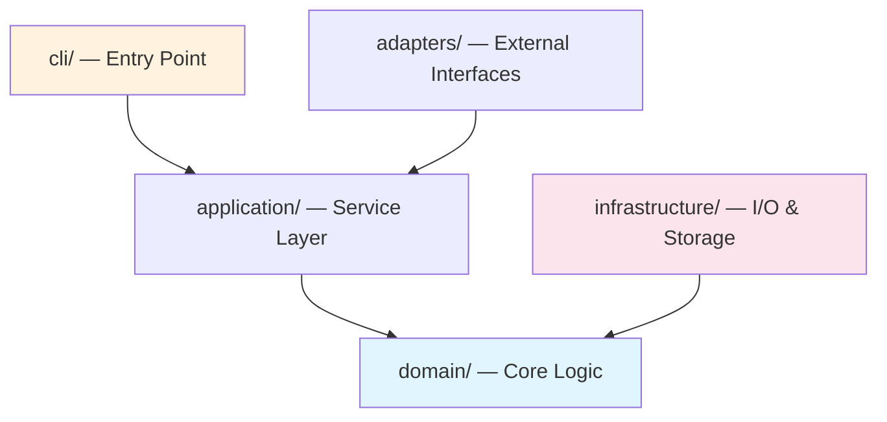
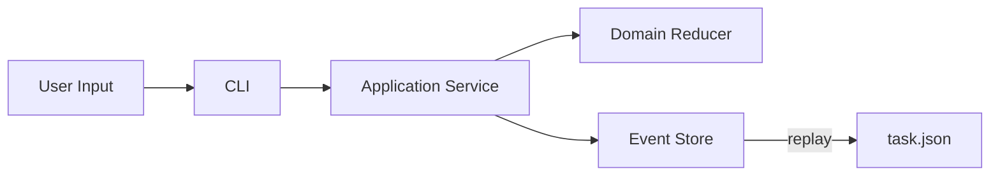
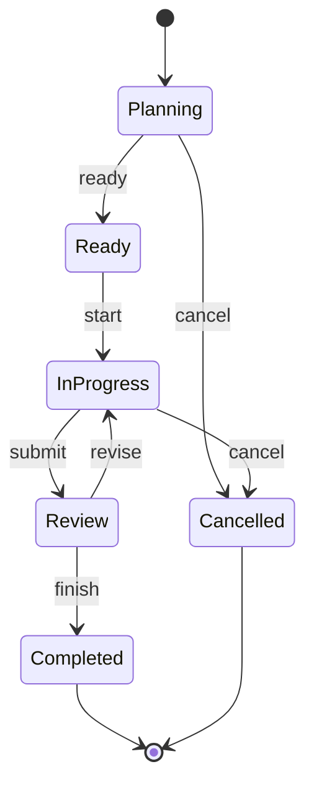

# /ctl-spec-bootstrap — Generate Project Specs from Source

Analyzes the real codebase and produces `.ctl/spec/` documentation with concrete patterns, architecture diagrams (Mermaid), directory trees, file paths, conventions, and anti-patterns extracted from source.

**Run when**:
- Introducing `ctl` to a new project (`ctl init` already ran)
- After significant refactoring that invalidates existing specs
- User explicitly requests `/ctl-spec-bootstrap`
- Hook detects spec drift (specs stale relative to code changes)

**Supports**: Rust, TypeScript/JavaScript (frontend + Node), Java (Maven/Gradle), Go, Python, and mixed-language projects.

## Step 0: Verify prerequisites

```powershell
ctl doctor
```

If `.ctl/` doesn't exist, run `ctl init` first.
If `.ctl/spec/` already exists, read all existing files — this is a **refresh**, not overwrite.

## Step 1: Detect project type and language(s)

Read the root directory. Match marker files:

| Marker files | Language | Build / Package | Entry point |
|---|---|---|---|
| `Cargo.toml` | Rust | cargo | `src/main.rs` / `src/lib.rs` |
| `package.json` + `tsconfig.json` | TypeScript | npm/pnpm/yarn | `src/index.ts` |
| `package.json` (no tsconfig) | JavaScript | npm/pnpm/yarn | `src/index.js` / `index.js` |
| `pom.xml` | Java (Maven) | Maven | `src/main/java/.../Application.java` |
| `build.gradle` / `build.gradle.kts` | Java (Gradle) | Gradle | `src/main/java/.../Application.java` |
| `go.mod` | Go | go modules | `main.go` / `cmd/.../main.go` |
| `pyproject.toml` / `setup.py` / `setup.cfg` | Python | pip/poetry | `__main__.py` / `app.py` |
| `build.sbt` | Scala | sbt | `src/main/scala/...` |
| `mix.exs` | Elixir | mix | `lib/.../application.ex` |
| `Gemfile` | Ruby | bundler | `lib/.../rb` |
| `*.csproj` / `*.sln` | C# / .NET | dotnet | `Program.cs` |
| `vite.config.*` / `next.config.*` / `nuxt.config.*` | Frontend (SPA/SSR) | npm/pnpm/yarn | `src/main.tsx` / `pages/` / `app/` |
| `angular.json` | Angular | npm/ng | `src/main.ts` |
| `vue.config.*` | Vue | npm/vue-cli | `src/main.ts` |

**Mixed projects**: If multiple markers exist, treat each as a separate language module. Generate specs per language under `.ctl/spec/backend/`.

## Step 2: Map architecture

### 2.1 Generate directory tree

Read the full directory tree (depth 4 for large projects, 5 for smaller ones). Skip:
- `node_modules/`, `target/`, `build/`, `dist/`, `.git/`, `__pycache__/`, `.gradle/`, `.idea/`, `.vs/`
- `vendor/`, `third_party/`, `.cache/`

**Output**: Write a file tree diagram with descriptions into `directory-structure.md`:

```
src/
├── cli/                    # CLI argument parsing, command dispatch
│   ├── mod.rs              # Command routing (clap derive)
│   └── ...
├── application/            # Business orchestration, validation
│   ├── mod.rs              # ControlApp service
│   └── ...
├── domain/                 # Pure domain logic (no I/O)
│   ├── task.rs             # TaskState + reducer
│   ├── event.rs            # Event definitions
│   └── ...
├── infrastructure/         # Side effects: storage, network, filesystem
│   ├── store/
│   ├── boundary/
│   └── ...
└── main.rs                 # Entry point
```

### 2.2 Detect layer boundaries

For each source directory, determine its architectural role:

| Role | Indicators (any language) |
|---|---|
| **Entry / CLI** | Argument parsing, command dispatch, `main()`, route handlers, `@Controller` |
| **Application / Service** | Business orchestration, validation, `@Service`, use cases, command handlers |
| **Domain / Core / Model** | Data types, entities, value objects, state machines, business rules, no I/O imports |
| **Infrastructure / Data** | Database repos, API clients, file I/O, `@Repository`, adapters, gateways |
| **Presentation / UI** | Components, views, templates, styles, `@Component`, `.vue`, `.tsx` (render) |
| **Shared / Utils** | Helpers, constants, types used across layers |

**Language-specific heuristics**:

| Language | Layer detection signals |
|---|---|
| **Rust** | `mod.rs` structure, `use crate::` imports, `impl` blocks |
| **TypeScript** | Barrel exports (`index.ts`), `import` paths, decorator annotations |
| **Java** | Package naming (`controller`, `service`, `repository`, `model`, `config`), Spring annotations |
| **Go** | Package naming (`handler`, `service`, `repository`, `model`), interface definitions |
| **Python** | Module naming, `__init__.py` exports, framework patterns (Flask/Django/FastAPI) |
| **Frontend** | `components/` → Presentation, `hooks/` or `composables/` → Logic, `api/` or `services/` → Data, `store/` → State |

### 2.3 Trace dependency direction

1. Read main module / barrel export files
2. Trace imports between directories
3. Map: which layer depends on which
4. **Flag violations** (e.g., domain importing infrastructure)

## Step 3: Generate architecture diagrams (Mermaid)

### 3.1 Layer dependency diagram

Generate a Mermaid graph showing the dependency direction:



**Rules for the diagram**:
- Each box = one source directory (or group of related dirs)
- Arrow `A --> B` = "A depends on B" (A imports from B)
- Color code: Core/Domain = blue, Entry = orange, Infrastructure = red, Adapters = green
- If bidirectional dependency exists, mark as **VIOLATION** in red

### 3.2 Data flow diagram

For projects with clear request/data flow:



### 3.3 State machine diagram (if applicable)

For projects with explicit state machines:



**Embed all diagrams in `index.md`** under the Architecture section.

## Step 4: Extract coding conventions

### 4.1 Error handling

| Language | What to search for |
|---|---|
| Rust | `anyhow::`, `thiserror::`, `Result<`, `?` operator, `unwrap()` |
| TypeScript | `try/catch`, `Error` class, `Result<T, E>`, `Promise.reject` |
| Java | `throws`, `try/catch`, `@ExceptionHandler`, `Optional<T>` |
| Go | `error` return, `fmt.Errorf`, `errors.New`, `panic` |
| Python | `try/except`, `raise`, custom exception classes |
| Frontend | Error boundaries, `try/catch` in effects, error state |

### 4.2 Naming conventions

From actual code, extract:
- Module/package naming (snake_case, camelCase, kebab-case, PascalCase)
- Function/method naming
- Type/class/interface naming
- Constant naming
- File naming
- Test file naming
- CSS class naming (frontend: BEM, CSS Modules, Tailwind, etc.)

### 4.3 Testing conventions

| Language | Test indicators |
|---|---|
| Rust | `#[test]`, `#[cfg(test)]`, `tests/` dir, fixtures |
| TypeScript | `*.test.ts`, `*.spec.ts`, `describe/it`, `vitest`/`jest` |
| Java | `*Test.java`, `@Test`, JUnit/TestNG, `src/test/` |
| Go | `_test.go`, `func Test*`, `testing.T` |
| Python | `test_*.py`, `pytest`, `unittest`, `conftest.py` |
| Frontend | `*.test.tsx`, `@testing-library/react`, snapshot tests |

Extract: test location, naming, structure (AAA/GWT), fixture patterns, mock strategy.

### 4.4 State management

| Project type | State indicators |
|---|---|
| Rust | `struct State`, `apply()`, reducer pattern |
| Frontend (React) | Redux/Zustand/Jotai/Nuxt store, `useState`, context |
| Frontend (Vue) | Pinia/Vuex, `ref()`, `reactive()` |
| Java | Spring beans, JPA entities, session state |
| Go | Struct methods, repository pattern |
| Python | ORM models, session objects, state dicts |

### 4.5 Frontend-specific extraction

For frontend projects (React/Vue/Angular/Svelte):
- **Component structure**: file organization, naming, props typing
- **Styling approach**: CSS Modules, Tailwind, styled-components, SASS
- **Routing**: file-based vs config-based
- **API layer**: fetch wrappers, SWR/React Query, Axios interceptors
- **Build & bundling**: Vite/Webpack config, code splitting
- **Accessibility**: aria patterns, semantic HTML conventions

### 4.6 Java-specific extraction

For Java projects:
- **Framework**: Spring Boot, Quarkus, Micronaut, or plain
- **Dependency injection**: `@Autowired`, constructor injection, `@Inject`
- **Persistence**: JPA/Hibernate, MyBatis, jOOQ, or raw JDBC
- **API style**: REST (`@RestController`), GraphQL, gRPC
- **Configuration**: `application.yml`/`.properties`, `@Configuration`
- **Logging**: SLF4J, Logback, log levels convention

## Step 5: Generate spec files

Write concrete specs. Every rule must reference real code. No template text.

### 5.1 File structure

```
.ctl/spec/
├── backend/
│   ├── index.md                        # Architecture overview + Mermaid diagrams + checklists
│   ├── directory-structure.md          # Full tree diagram with role annotations
│   ├── [layer]-layer.md                # One per detected layer (domain, application, etc.)
│   ├── error-handling.md               # Error patterns from Step 4.1
│   ├── quality-guidelines.md           # Forbidden + required patterns, testing rules
│   └── logging-output-guidelines.md    # Output conventions (if CLI/server)
├── frontend/                           # Only for frontend projects
│   ├── index.md                        # Frontend architecture overview
│   ├── component-patterns.md           # Component structure, styling, props
│   ├── state-management.md             # State store patterns
│   └── api-integration.md              # API call conventions
└── guides/
    ├── index.md                        # Thinking guides overview
    ├── cross-layer-thinking-guide.md   # Multi-layer considerations
    └── [language]-conventions.md       # Language-specific style guide (if needed)
```

**Rules**:
- Only create files for layers/concepts that exist in the project
- Skip irrelevant files (e.g., no frontend → no `frontend/` dir, no CLI → no `cli-layer.md`)
- "How to write code" → `backend/` or `frontend/`. "What to think about" → `guides/`

### 5.2 index.md structure

```markdown
# [Project Name] Development Guidelines

> [One-line project description].
> Language: [Rust/TypeScript/Java/Go/Python/Mixed]
> Build: [cargo/npm/maven/gradle/go/pip]

---

## Architecture Overview

### Layer Diagram

[Mermaid layer diagram from Step 3.1]

### Data Flow

[Mermaid data flow from Step 3.2]

### Dependency Direction

[layer1] → [layer2] → [layer3]
[infrastucture layers] → [domain]

**Violations**: [none / list any]

---

## Directory Structure

[Annotated tree from Step 2.1 — or link to directory-structure.md]

---

## Pre-Development Checklist

Before writing code:
- [ ] Read the layer spec for the target module
- [ ] Verify change scope against dependency direction (see diagram above)
- [ ] Check quality-guidelines.md for forbidden patterns
- [ ] [Build command]: `[cargo check / npm run build / mvn compile / go build]`

## Quality Check

After implementation:
- [ ] [Build command] passes
- [ ] [Test command] passes
- [ ] [Lint command] passes
- [ ] No layer boundary violations
- [ ] New types have test coverage

## Guidelines Index

| Guide | Description | Layer | Status |
|-------|-------------|-------|--------|
| ... | ... | ... | Generated/Refreshed |
```

### 5.3 Per-layer spec structure

Each layer spec MUST contain:

1. **Purpose**: One sentence — what this layer does
2. **Directory**: Which directories belong to this layer
3. **Allowed imports**: What this layer may depend on
4. **Forbidden imports**: What this layer MUST NOT depend on (with explanation)
5. **Patterns**: Good examples from actual code (file path + snippet)
6. **Anti-patterns**: Things to avoid (with "why" and "instead" examples)
7. **Testing**: How to test code in this layer

### 5.4 Directory-structure.md

Must contain:
1. **Full annotated tree** (from Step 2.1)
2. **Layer color legend** mapping colors to architectural roles
3. **Key files table**:

```
| Path | Role | Description |
|------|------|-------------|
| `src/domain/task.rs` | Domain | TaskState definition and reducer |
| `src/cli/mod.rs` | Entry | Command dispatch via clap |
```

### 5.5 Frontend-specific specs (if frontend project)

**frontend/index.md**:
- Framework (React/Vue/Angular/Svelte)
- Rendering strategy (CSR/SSR/SSG)
- Routing approach
- State management choice and why
- Styling approach

**frontend/component-patterns.md**:
- File naming and organization (e.g., `ComponentName/index.tsx`)
- Props typing pattern
- Styling convention (with examples)
- Composition vs inheritance patterns
- Accessibility requirements

**frontend/state-management.md**:
- Store structure
- Action/mutation patterns
- Selector patterns
- Side effect handling (async actions, API calls)

## Step 6: Verify generated specs

Before finishing, validate:

1. **No placeholders**: Search for `TODO`, `FIXME`, `[placeholder]`, `<example>`, `...`. Remove all.
2. **Real file paths**: Every path mentioned must actually exist in the project.
3. **Real code examples**: Every code block must be from actual source (or a correct simplification).
4. **Mermaid renders**: All diagrams are valid Mermaid syntax (test in any Mermaid renderer).
5. **Consistency**: Rules in different files don't contradict.
6. **Completeness**: Every source directory is covered.
7. **Index links**: Every file in Guidelines Index actually exists.

## Step 7: Report

```
✅ Specs generated for [project name]

  Language: [language(s)]
  Build: [build tool]
  Layers detected: [list]

  .ctl/spec/backend/
    index.md                          (architecture + Mermaid diagrams + checklists)
    directory-structure.md            (annotated tree + key files table)
    [layer]-layer.md                  (per detected layer)
    error-handling.md                 (error patterns)
    quality-guidelines.md             (forbidden/required patterns)
  .ctl/spec/frontend/                 (if frontend project)
    index.md                          (frontend architecture)
    component-patterns.md             (component conventions)
    state-management.md               (state patterns)
    api-integration.md                (API call conventions)
  .ctl/spec/guides/
    index.md                          (thinking guides)
    cross-layer-thinking-guide.md     (multi-layer considerations)

  Source files analyzed: [N]
  Layers detected: [N]
  Architecture diagrams: [N]
  Patterns extracted: [N]
  Anti-patterns documented: [N]

  Refresh with: /ctl-spec-bootstrap
```

## Hook Integration: Spec Drift Detection

The `ctl-context.js` hook automatically detects when specs may be stale:

- On `agent_end`: if code files were modified but `.ctl/spec/` wasn't touched, the hook logs a drift warning
- On `session_shutdown`: if drift was detected, reminds user to run `/ctl-spec-bootstrap`

The hook calls `ctl hook spec-status` to check freshness (compares spec file mtimes vs source mtimes).

## Rules

- **Idempotent**: Re-running updates stale sections, preserves manually-added content.
- **Source-backed**: Every recommendation points at a real file or repeated pattern.
- **No generic advice**: Don't write "use good variable names" — write "use camelCase for functions (see `src/services/UserService.java:getUser()')".
- **Language-appropriate**: Convention names and patterns must match the project's actual language.
- **Respect existing**: If `.ctl/spec/` already has good content, refresh only what changed.
- **Mermaid everywhere**: Every architecture relationship gets a Mermaid diagram. Text descriptions supplement, not replace.
- **Frontend is first-class**: Frontend projects get the same depth of analysis as backend. No "TODO: add frontend specs".
- **Java is first-class**: Spring/Gradle/Maven conventions extracted from actual annotations and configs.
