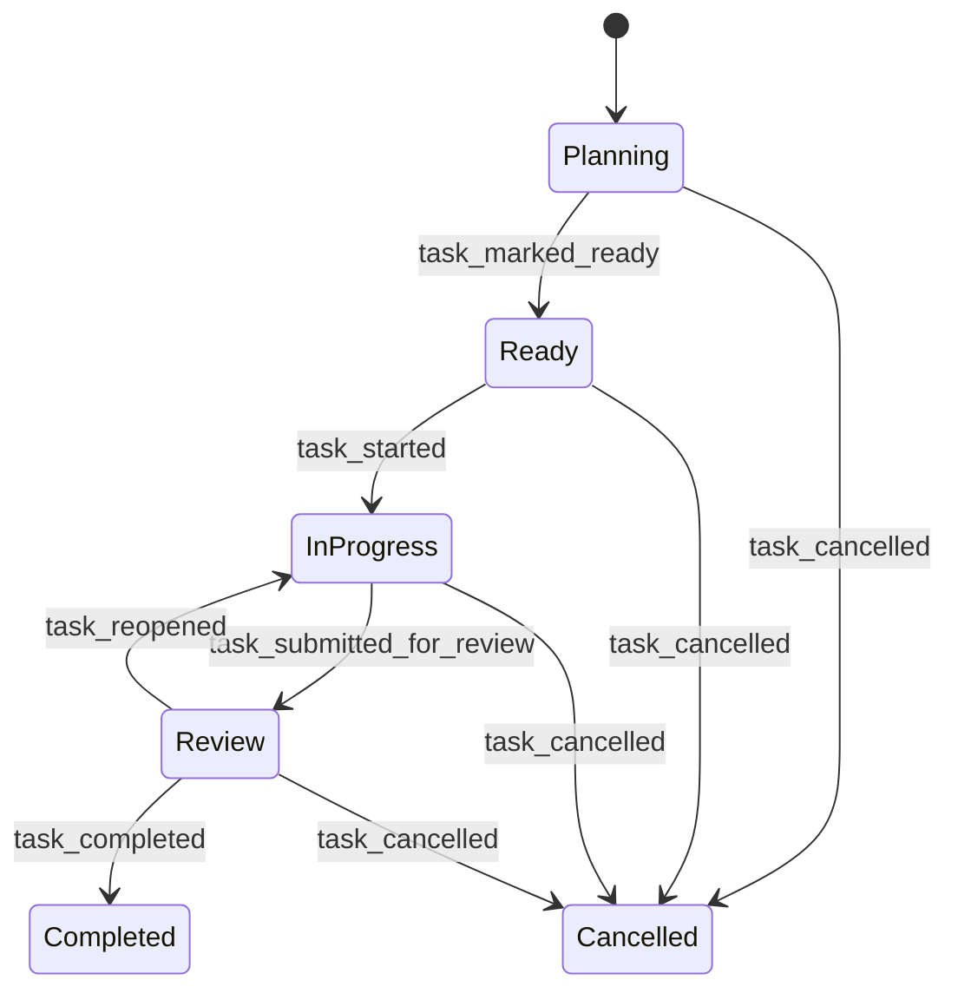

# AI Dev Control Plane 落地路线图

后续设计与实现必须遵守：[ARCHITECTURE_GUARDRAILS.md](./ARCHITECTURE_GUARDRAILS.md)。

## 总原则

能力进入系统的顺序必须是：

```text
可表达 -> 可校验 -> 可审计 -> 可隔离 -> 可执行 -> 可并发
```

不能跳级。边界优先于自动化程度，确定性优先于智能程度。

第一版产品停在 `M3 Manual 闭环 MVP`。它不依赖模型，也已经能用于真实任务治理。`M4` 以后必须根据 dogfood 结果决定是否继续。

## 信任模型

默认假设：

```text
agent 输出不可信
仓库文本、网页和 MCP 返回值可能包含 prompt injection
adapter 和 MCP server 默认不可信
control CLI 是 trusted computing base
模型不能自行决定授权
telemetry 是 evidence，不是真相
```

一句话分工：

```text
prompt 负责提出动作
policy 负责判断动作
sandbox 负责限制动作
event log 负责解释动作
```

`worktree` 用于隔离变更和降低冲突，不是安全边界。`MCP roots` 用于提示范围，也不是访问控制。真正的强制边界必须由控制层 policy 与 sandbox 执行。

## 受控执行协议

OMP dogfood 证明，仅限制工具调用不足以约束模型行为。控制层还必须约束授权、审计与完成声明：

```text
结构化 proposal
  -> pending_approval
  -> scoped lease
  -> implement
  -> audit_hold
  -> deterministic audit
  -> human_resume | completed | stopped
```

协议原则：

- proposal 声明 milestone、objective、allowed paths、schema 变化、依赖变化、required gates 和禁止变化。
- 人类批准结构化 proposal 后，控制层才生成绑定 task、run、资源、动作、TTL 和最大使用次数的 lease。
- scope 扩大必须生成新的 proposal，不能由模型自行推断。
- 审计触发器命中后立即进入 `audit_hold`。该状态只能运行只读检查和允许模板内的离线 gate。
- `ASK`、`STOP` 与 `UNVERIFIED` 是合法终态，不会因为模型被要求“持续完成任务”而自动绕过。
- completion interlock 独立检查证据、baseline 回退与未决审批。模型和 reviewer 都不能自行宣布完成。

自动 reviewer 只在后续 adapter 协议稳定后接入。它是额外 sensor，不是事实源，也不是机器 gate 的替代品。

## 事实模型

```text
events.jsonl     = append-only canonical truth
telemetry.jsonl  = append-only evidence index
task.json        = 由 replay 重建的任务投影视图
control.json     = 由 reconcile 重建的决策投影视图
artifacts/       = 被 hash 引用的不可变证据
Markdown         = 人类可读解释，不参与状态判断
```

外部执行器不能直接追加 canonical event。agent、adapter 和人工工具只能提交 evidence，由控制层验证后生成事件。

`MVP` 只做一个 aggregate：`Task`。`AgentRun`、worktree 和 telemetry 先保留引用字段，出现并发执行需求后再拆分。

## Task 状态模型



`hold` 与 `archived` 不进入 phase：

- `hold` 是正交状态：越界、gate 失败、等待审批或人工暂停都可以触发。
- `archived` 是存储属性：终态任务归档后仍然保留 `completed` 或 `cancelled` 语义。
- `boundary_violation_recorded` 必须同时记录越界并进入 hold，避免崩溃后继续执行。

关键不变量：

| 操作 | 前置条件 |
|---|---|
| `ready` | objective、scope、至少一个 gate 合法 |
| `start` | phase 为 `ready`，没有 hold |
| `submit` | phase 为 `in_progress`，没有 hold |
| `finish` | phase 为 `review`，所有 required gate 最新结果通过，没有 hold |
| `archive` | phase 为 `completed` 或 `cancelled` |
| `revise` | MVP 只允许 phase 为 `planning` |

## MVP 数据结构

### EventEnvelope

```text
schema
event_id
command_id
task_id
seq
occurred_at
actor
type
payload
```

### TaskDefinition

```text
schema
id
mode
objective
baseline_commit
read_scope
write_allow
write_deny
risk_triggers
gates
```

### PolicyDecision

```text
allowed
rule_ids
diagnostics
approval_required
```

### Assignment

```text
id
task_id
adapter
contract
scopes
context_hashes
required_capabilities
acceptance
```

### Evidence

```text
run_id
source
command
exit_code
touched_files
input_hashes
output_hashes
```

所有边界对象使用 JSON Schema Draft 2020-12，默认关闭未知字段：

```json
{"unevaluatedProperties": false}
```

## 里程碑

### M0：边界协议冻结

**用户价值**

团队知道系统承诺什么、不承诺什么。先冻结协议，再写执行器。

**交付内容**

```text
schemas/
  control.task-definition.v1.schema.json
  control.event-envelope.v1.schema.json
  control.task-view.v1.schema.json

ctl schema validate
ctl boundary check
ctl boundary explain
ctl architecture check
```

定义：

- `TaskDefinition`、`Scope`、`Gate`、`EventEnvelope`。
- 事件表、状态转换表和 reducer fixtures。
- 路径规范化规则：Windows 大小写、分隔符、绝对路径、`..`、symlink、junction、UNC。
- 默认拒绝和 hard forbid 规则。
- proposal、scoped lease、`audit_hold`、completion interlock 与 baseline manifest 的协议。
- 固定审计矩阵及 `PASS / ASK / STOP / UNVERIFIED` 判定规则。
- proposal、approval、scoped lease、assignment、evidence、audit report、completion interlock 与 drift report 的最小 schema 方案；本阶段只冻结文档设计，不修改 `schemas/**`。

**退出条件**

- 合法 fixture 通过 schema 校验。
- 未知字段、缺少 gate、非法状态转换被拒绝。
- `..`、绝对路径、symlink、junction、UNC 和 root 外路径被拒绝。
- 相同事件流始终生成相同 `task.json`。
- hard forbid 不能被 permit 或 approval 覆盖。
- 测试、fixture、schema 或 required gate 数量下降时触发 baseline 回退并停止。
- 审计触发后进入只读 `audit_hold`，未通过 completion interlock 时不能生成完成事件。
- 固定审计矩阵至少覆盖 schema 反例、非法状态转换、replay、Windows 路径逃逸、受保护文件、依赖和 required gate 变化。

**暂不做**

有副作用的执行器、真实工作区 diff 集成、自动 reviewer、agent、telemetry 评分、drift 自动化、网络访问。

### M1：本地任务账本

**用户价值**

可以稳定记录任务生命周期，并在中断后恢复。

**命令**

```text
ctl init
ctl task create
ctl task revise
ctl task ready
ctl task start
ctl task status
ctl task cancel
ctl replay
ctl validate
ctl doctor
```

**实现约束**

- `events.jsonl` 是唯一可追加领域事实。
- `task.json` 只能由 reducer 生成，禁止人工或 agent 写入。
- 每条事件拥有严格递增的 `seq` 和幂等 `command_id`。
- reducer 不访问时间、Git、文件系统或网络。
- 写视图使用临时文件和原子替换。

**退出条件**

- 临时 Git 仓库内可以跑通创建、ready、start、cancel 生命周期。
- 删除 `task.json` 后可以仅依赖 `events.jsonl` 恢复。
- 重复 replay 输出字节级一致。
- 缺失、重复和损坏事件被拒绝，不静默修复。
- 归档终态之外的任务不能归档。

**暂不做**

上下文 manifest、gate 执行、adapter、并发 append。

### M2：验收、边界与归档

**用户价值**

任务可以明确声明“允许修改什么”，并且在完成前接受机器验收。

**命令**

```text
ctl context build
ctl boundary check
ctl boundary explain
ctl gate run
ctl gate record
ctl task submit
ctl task reopen
ctl task finish
ctl task archive
ctl reconcile
```

**实现约束**

- M0 的协议级 `boundary check / explain` 在此接入真实工作区 diff、上下文 manifest 和任务生命周期。
- `finish` 自动执行 scope check、required gates、事件追加和视图折叠。
- `baseline_commit` 与任务启动前脏工作区快照分开记录，避免误判。
- `.git/**`、策略文件、gate 定义、canonical events 默认禁止写入。
- gate runner 明确命令模板、工作目录、环境变量、超时与日志脱敏。
- `boundary_violation_recorded` 自动进入 hold。

**退出条件**

- 越界修改能够被拦截，并输出命中规则、证据和解除方式。
- gate 未通过时无法 finish。
- agent 自述或伪造 telemetry 不能直接完成任务。
- 归档冲突可检测，重复归档具备幂等语义。
- `small` 任务从创建到归档可以在真实仓库使用。

**暂不做**

自动 agent 执行、策略 runtime、任意 shell、依赖自动安装。

### M3：Manual 闭环 MVP

**用户价值**

不接任何模型，也能把 AI 开发任务变成可声明、可审计、可验收的受控过程。

**命令**

```text
ctl assignment create
ctl assignment export
ctl run ingest --adapter manual
ctl audit
ctl report
```

**实现约束**

- `manual` 是第一个正式 adapter，不是临时兜底。
- 人或任意 AI 工具读取 `assignment.json`，工作后提交 `agent-output.json`。
- 控制层独立检查实际 diff、gate 和证据 hash。
- `assignment.json` 和 `agent-output.json` 是后续 OMP adapter 的 contract test 基线；自动执行器不得另建隐式协议。
- `small / medium / large` 是风险控制级别，不只是文档数量选项。
- 允许显式升级模式，禁止静默降级。

**退出条件**

- 从任务创建、assignment export、人工执行、output ingest、gate 到归档端到端通过。
- 中断后 `control status` 可以恢复上下文。
- evidence 包含输入、输出、命令和文件 hash。
- 重放后 audit 结论一致。
- 使用 M3 完成至少 10 个真实 small 任务。

**暂不做**

OMP 调用、多智能体、连续 drift 分数、daemon、数据库。

### M4：OMP 单执行器隔离运行

**用户价值**

OMP 可以执行单个 assignment，同时守住主工作区边界。

**命令**

```text
ctl adapter capabilities omp
ctl workspace create
ctl workspace diff
ctl workspace apply
ctl run start --adapter omp
ctl approval request
ctl approval grant
ctl approval deny
```

**实现约束**

- OMP 只在 disposable worktree 中写入。
- worktree diff 必须经过 apply gate，不能直接进入主工作区。
- 越界 diff 永远不能 apply。
- 删除、依赖变化、Git 操作、网络访问、公共 API 和安全策略变化需要 step-up approval。
- approval 只能批准结构化 request，不能批准一句自然语言。
- lease 绑定 task、run、资源、动作、TTL 与最大使用次数。
- OMP adapter 必须映射通用的 `proposal -> lease -> implement -> audit_hold` 协议，不能另建一套隐式授权状态。
- 自动 reviewer 可以提交 review evidence，但 completion interlock 仍由控制层执行。

**退出条件**

- OMP 中断后可以恢复或明确失败。
- 越界 diff、过期 lease、跨任务 lease 和重复 lease 全部拒绝。
- 高风险变更未经 approval 不能 apply。
- 至少用 M3/M4 完成 20 个真实任务，再决定是否进入 M5/M6。

**暂不做**

并发写入、自动合并、其他执行器 adapter、长期密钥注入。

---

## 决策记录：dogfood 门已满足，进入 M5（2026-06-14）

M0–M4 的退出条件「至少用 M3/M4 完成 **20 个真实任务**，再决定是否进入 M5/M6」**已达成**：

- 任务账本累计 **66 个 completed**（走完整生命周期）+ 17 个 cancelled（弃置实验）。
- 仅算真功能/里程碑（非冒烟探针）也有 **30+ 个**：本轮硬层 8 个（M-a…M-g / M-f / M6-reviewer
  / flaky 修复 / 分发对齐）、更早的 quick-mode·stepup·architecture-convergence·unify-governance
  等、以及 `df-m4-01…21` 的 M4 dogfood 批。
- 治理层（边界·账本·门·审核·提交联锁·身份绑定）不仅实现且**在线强制**，并被这 66 个任务反复压测
  （本轮 9 个提交全程 dogfood，连 `cargo install` 自身都走 deps 审批 + 完成审计流程）。

**结论**：M5/M6 的前置条件满足。**下一个任务开启 M5（可解释控制闭环）**；M6 主体（完整 capability
lease 并发）按 ROADMAP 仍排在 M5 之后。

---

### M5：可解释控制闭环 ✅ 已实现

**用户价值**

系统可以回答“为什么继续、暂停或重规划”。

**命令**

```text
ctl telemetry add        # 向证据索引追加一条信号
ctl drift compute        # 透明规则算出 drift level/score
ctl drift explain        # 列出信号、规则 ID、evidence 与建议动作
ctl next-action          # pass / ask / stop / replan / rescope（只读、建议性）
```

**实现约束**

- drift 首先使用透明规则，不使用模型自由打分。
- 相同 evidence 和规则必须生成相同决策。
- 未知信号默认不能放宽权限。
- drift 升高只能触发暂停或重规划，不能自动扩权。
- `replan` 和 `rescope` 只生成结构化 proposal，并停止当前执行；不得自动修改 scope、批准 lease 或启动新任务。

**退出条件**

- Golden fixtures 对应固定动作。
- 每次决策列出信号、规则 ID 和 evidence。
- `control.json` 可以由 reconcile 重建。

**暂不做**

模型评分、dashboard、OpenTelemetry Collector、自动重规划执行。

**已落地**：

- **证据索引而非 canonical event**——按事实模型，telemetry 是*独立的 append-only 证据索引*
  （`.ctl/telemetry.jsonl`），不是 canonical event：`ctl telemetry add` 是 M5 唯一写操作。
  因此 **冻结的 event-envelope schema 与 reducer 完全不动**（telemetry 是 evidence 不是真相，
  也不该污染 canonical 事件流）。条目带 `schema/task_id/kind/value/recorded_at/source`，
  `recorded_at` 由应用层打戳，domain 保持无时钟。
- **纯函数 drift 引擎**——`src/domain/drift.rs`（无 IO、无时钟，过 MODULE-001/002 纯度门）：
  `evaluate(signals)→DriftReport` + `next_action(report,phase)→NextActionProposal`。
  固定规则目录 DRIFT-001…009（边界越界 30 / 门失败 20 / 审核 needs_work 25 / 测试失败 15 /
  lint 5 / retries≥3 15 / 越界写 30 / held 10 / 未知信号 10），**整数计分**、规则按 ID 升序输出，
  故相同 signals 字节一致。level 阈值 none=0 / low=1–19 / medium=20–49 / high≥50。
- **next-action 决策表**（首个命中胜出，确定性）：未知信号→`ASK`（失败关闭，绝不放宽）·
  high+越界信号→`STOP`· high→`REPLAN`· medium+in_progress→`RESCOPE`· medium→`ASK`·
  held→`STOP`· low/none→`PASS`。`REPLAN`/`RESCOPE` **只产出结构化 proposal**（CLI 打印），
  不发事件、不改 scope、不批 lease、不启动任务——全程建议性。
- **决策投影进 control.json**——`generate_board()` 每任务行追加 `drift_level/drift_score/
  drift_rules/recommended_action`；`reconcile` 重建，且**带 telemetry 时重复 reconcile 仍字节一致**
  （信号取整数、引擎无时钟）。signals 由 `drift_signals_from(events,state,telemetry)` 统一派生，
  `compute_drift`/`next_action` 与 board 投影同口径。
- **测试**：drift 纯函数单测（逐规则、阈值边界、确定性、不放宽不变量）+ golden fixture
  `fixtures/m5_drift_golden.json`→固定动作 + store telemetry round-trip + 应用层
  （telemetry_add 写/dry-run 不写、compute/next-action 不发事件、reconcile 字节一致）。共 215 测试绿。

### M6：受限多智能体

**用户价值**

在写入范围不重叠的前提下安全并行，提高吞吐量。

**命令**

```text
ctl schedule plan
ctl schedule validate
ctl schedule run
control agent report
ctl workspace merge-candidate
```

**实现约束**

- 这时再拆出独立 `AgentRun` aggregate。
- 每个写入 agent 使用独立 worktree 和 capability lease。
- 每个写入 agent 必须有独立 scoped lease；lease 的 write scope 不能与其他写入 agent 重叠。
- 重叠写 scope 必须拒绝。
- 只读任务可以并发。
- 合并候选仍需人工确认。

**退出条件**

- 重叠写入被拒绝。
- 崩溃恢复不会重复执行副作用。
- 共享 `.git` 风险有明确防护。
- 脏工作区和合并冲突可以恢复。

**暂不做**

全自动 merge、commit、push、deploy、动态扩权和多厂商并发。

## 子代理审核门（硬层，设计冻结）

软层已先行落地：control-guard 指挥主代理在「申请编辑」和「任务完成」时派只读 `ctl-review`
子代理审核/审计，靠约定与 `explore` 只读放行生效。下列硬层把它从「约定」升级为「网关强制」，
**顺序是先修治理基座、再上强制审核门**——每条都依赖前一条。除已标注 ✅ 的条目外，本节为设计、未启用。

### M-a：网关多活动任务治理（强制审核门的前置）✅ 已实现

**问题**：`compute_gov_state`（`src/cli/mod.rs`）遇到第一个 `in_progress` 任务即 early-return；
多个任务同时活动时，其余在网关层静默失管。并发子代理审核会制造多活动任务，不修则强制门名存实亡。

**方向**：网关按「派发该工具调用的那个任务」绑定治理（见 M-e），或在存在多活动写入任务时显式拒绝。
与 M5（reconcile）的活动任务集合定义对齐。

**已落地**：先取「显式拒绝」分支，后由 M-e 补上派发绑定（见下）。`compute_gov_state` 改为收集**全部**
非归档 `in_progress` 任务而非首个；**活动写入任务**定义为 phase=`in_progress`、非归档、`write_allow`
非空。≥2 个活动写入任务时返回新状态 `MultipleActive { task_ids }`，网关对 `write`/`edit` 与可写子代理
**失败关闭**（只读、`cargo check/test/build/fmt` 等非变更操作仍放行，便于消歧期间验证）；恰好 1 个写入
任务时按该任务绑定治理（held 优先），与旧单任务行为一致。只读 `in_progress` 任务（空 `write_allow`）
不产生写治理歧义。消解方式：`ctl task submit`/hold 其余任务只留一个 `in_progress`，**或**用派发令牌把
单次调用绑定到某个活动任务（M-e）。

### M-b：control.json + `ctl board`✅ 已实现

**用户价值**：跨任务集中视图。reconcile 投影 `control.json`（AGENTS.md 预留，M5+），
`ctl board` 按 phase / hold / active / gate / 审核裁决聚合全部任务。审核裁决数据来自软层的
verdict→evidence 事件。

**已落地**：
- 投影——`ControlApp::generate_board()` 对事件账本作纯函数投影（**无墙钟字段，重复 reconcile
  字节一致**，与 task.json 同语义），每任务一行 + 聚合 totals；`project_control()` 原子写
  `.ctl/control.json`（temp+rename）。`reconcile()` 末尾顺带投影 control.json。
- 列定义——phase / `held` / `active` / `gates_passing`/`gates_total` / `review` / `write_scope`。
  `active` 与 M-a 的网关关注集合对齐:非归档且 phase ∈ {in_progress, review}。
- 审核裁决——`review_status_from_events` 从软层 `evidence_rejected`/`evidence_accepted` 事件派生
  `needs_work | passed | none`，与 finish 联锁同口径(只认 file-keyed 未解决驳回)。
- CLI——`ctl board`(人类表格)/ `ctl board --json`(脚本/adapter);已登记进 CLI surface 守卫。
- `control.json` 暂不版本化 JSON Schema(派生投影、`.ctl/` 被 gitignore),待 M5 reconcile 正式化时再定。

### M-c：跨任务影响接入网关 ✅ 已实现

**方向**：「申请编辑」时调用现有 `src/application/schedule.rs::detect_write_scope_overlap`，
本次写入若撞上其他活动任务的 `write_allow` 则硬拒；补全当前为桩的 `ctl schedule validate` /
`ctl schedule run`。

**已落地**：
- 网关跨任务硬拒——`first_overlapping_active_task`(`src/cli/mod.rs`):`write`/`edit` 命中治理任务
  自身 `write_allow` 后,**再查是否落入其他活动任务的 `write_allow`**,命中即硬拒并回报
  `conflicting_task`。"活动"沿用 `ctl board` 口径(`in_progress | review`,非归档),全程一个
  "活动"定义贯穿 M-a/M-b/M-c。这是 `detect_write_scope_overlap` 的单路径特化(路径 vs 集合);
  与 M-a 互补——M-a 拦"多个 in_progress 写任务",M-c 拦"in_progress 写入踩进 review 任务(M-g
  提交窗口)的领地"。spec 路径(`.ctl/spec`)仍前置放行,不受此限。
- `ctl schedule validate`——读取 `.ctl/plans/<id>.json`,对计划内每个任务取当前状态,跑
  `schedule::validate_plan`(同时修正其 phase 字符串期望 `Ready/InProgress`→规范的
  `ready/in_progress`),输出有效/逐条 INVALID 并以非零退出。
- `ctl schedule run`——补全到**安全边界**:先按活态重校验,**无效计划拒绝执行**;有效则解析并打印
  分组并行安全的执行顺序。真正的并发监督(worktree-per-agent、capability lease、文件锁、崩溃恢复)
  按设计留给 M6,本命令永不 spawn 执行器。

### M-d：跨任务依赖边 ✅ 已实现

**方向**：在调度现有的互斥分组之上增加「A 先于 B」的依赖关系（恢复 Trellis parent/child 的能力），
依赖写入任务声明而非靠树位置隐含。

**已落地**：
- 任务声明、持久化——`task_created`/`task_revised` payload 新增**可选** `depends_on`(task ID 列表),
  随 canonical 事件持久化;空依赖时不写该键,保持无依赖事件字节不变。**此 schema 改动属受保护
  边界变更**(`schemas/` 被边界 normalizer 拒入 `write_allow`),由人类显式授权后施加,而非 agent 经
  任务自助修改——符合"禁止 agent 改 canonical event"原则。reducer(`src/domain/task.rs`)用
  `optional_string_set` 解析(缺省即空)。
- 调度拓扑——`plan_schedule`(`src/application/schedule.rs`)在 M-c 写隔离分组之上叠加依赖:`B`
  依赖 `A`(均在计划内)则 `B` 必落入比 `A` 更晚的组;按(依赖层级, id)贪心 earliest-fit 分配;无
  依赖时退化为原互斥分组行为(既有测试不变)。计划外的依赖边视为已满足(忽略)。
- 环检测——Kahn 算法,`plan_schedule` 对存在依赖环的计划返回 `Err` 并列出涉及任务;`ctl schedule
  plan` 据此拒绝并非零退出。
- 校验——`validate_plan` 增加依赖序检查:每个计划内前置必须在更早的组,否则 INVALID。
- CLI/可观测——`ctl task create/quick/revise --depends-on` 声明;`ctl task status`(人类+`--json`)、
  `ctl board --json` 与 `control.json` 均展示 `depends_on`(持久化的 `task.json` 投影受 task-view
  schema 冻结,暂不改,故不含该字段)。

### M-e：子代理↔任务绑定 ✅ 已实现

**方向**：可写子代理按「派发它的那个任务」的 `write_allow` 受治，而非网关扫描第一个活动任务；
与 M6 `AgentRun` aggregate 和 capability lease 对齐。

**已落地**：
- 派发令牌——`ctl hook gate` 新增 `--task <id>`，缺省回退到 `CTL_TASK_ID` 环境变量（空值视为无绑定）。
  `.claude/hooks/ctl-gate.py` 从 `CTL_TASK_ID` 透传 `--task`，作为显式且可审计的接缝；ctl 自身亦读同名
  env，二者互为兜底。
- 绑定治理——把 M-a 的「收集全部活动任务 → 归约为单一治理态」抽成纯函数 `resolve_active_governance`
  （无 IO，直接单测）。令牌命中某个活动任务时，**即使存在多个活动写入任务也按该任务绑定**
  （派发已显式声明，无歧义可言）；令牌指向非活动/未知任务则视为过期、忽略，回退到 M-a 扫描
  （≥2 写入任务仍 `MultipleActive` 失败关闭，绝不因坏令牌扩权）。绑定到 held 任务仍 held；绑定到只读
  任务则按其空 `write_allow` 拒写——每个子代理按**它自己**的任务受治。
- M-c 跨任务写重叠对绑定任务依然生效（绑定不豁免重叠硬拒）。
- 8 条纯函数单测 + 真实 ledger e2e：无绑定写→`multiple_active` 拒；`--task`/`CTL_TASK_ID` 绑定→
  `in_progress` 放行本作用域、拒他作用域；过期令牌→回退 `multiple_active`。
- 这关闭了 M-a 遗留的「M-e 子代理绑定仍留后续」，并解除 M-f 的前置依赖（M-a + M-e 均就绪）。

### M-f：硬版审核门 ✅ 已实现（审计人绑定属 M6）

**命令**

```text
ctl apply --path <p>      # 越界编辑申请 → 路径级 approval；grant 后网关放行该路径 ✅
ctl review accept|reject  # 记录完成审计裁决（pass/fail）✅
ctl task finish           # 联锁：要求存在通过的完成审计裁决事件 ✅
```

**依赖**：M-a（多活动任务治理）+ M-e（子代理绑定）——两者均已就绪，前置依赖已解除。

**已落地（完成审计联锁）**：把审核从「软层约定」（control-guard 派只读 ctl-review 子代理）升级为
**网关联锁**——`finish`（Review→Completed）现要求存在一条**新鲜的通过完成审计**裁决。
- 裁决事件——`ctl review accept|reject --id <task> [--note]`，应用层 `record_completion_audit`。
  复用现有 `evidence_accepted`/`evidence_rejected`，以区分性 `source="completion_audit"` 标记
  （`schemas/control.event-envelope.v1.schema.json` 的 `source` 为自由串，**无需改冻结 schema**）；
  审计人身份由事件顶层 `actor` 携带。只能在 Review 录入（提交后的审计窗口）。
- 新鲜度——裁决只在「晚于最后一次 `task_submitted_for_review` 的 seq」时才计入；返工
  （reopen→resubmit）会让上一轮的 pass 失效。最新一条 `completion_audit` 裁决必须是 pass；
  fail 或全无审计 → 拒绝 finish。与 M-g 干净树联锁并列检查。
- 流程：implement → submit(→Review) → `ctl review accept`（完成审计）→ commit/push（M-g 窗口）→
  finish（M-f+M-g 双联锁）→ archive。
- 5 条应用层单测 + 真实 ledger e2e：无审计→拒；reject→拒（FAIL）；accept→放行；返工后旧 pass 作废。

**已落地（分发对齐）**：软层技能改为调用硬层命令，关闭 review-contract 分发缺口——
- `control-guard/SKILL.md`：关闭流程 Step 5 与 Gate 2 插入 `ctl review accept|reject`，
  「verdict → event」节给出具体命令并标明 mode=B 完成审计为 `finish` 硬前置；命令参考新增
  「Record audit verdict」行。
- `ctl-review/SKILL.md`：声明只读 reviewer 不能写，裁决由派发者经 `ctl review` 录入，要求输出
  明确 pass/fail + 一行摘要供 `--note`。
- `.ctl/spec/guides/review-contract.md`：verdict 节标明录入命令与 mode=audit 的硬门语义。

**已落地（ctl apply 越界编辑放行）**：把 mode=A 编辑审核从软层升级为网关有条件放行——
- `ctl apply --id <task> --path <p> --reason <r>`：把越界编辑建模为**路径级 approval**
  （`scope={action:"apply", path}`），复用既有 approval 事件/grant 流（**无需改冻结 schema**）。
  grant（应在 ctl-review mode-A pass 之后发）即记录的 reviewer 裁决。
- 网关 `write/edit` 分支：目标在 `write_allow` 之外时，若存在覆盖该路径的已授予 apply → 放行
  （reason=`reviewed out-of-scope exception`）；否则拒绝并提示 `ctl apply`。放行是**按路径**的
  （只开被授予的那条），且 **M-c 跨任务重叠仍硬拒**（apply 不豁免重叠）。
- `GovState::InProgress` / `ActiveTask` 增 `approved_apply_paths`，由 `compute_gov_state` 从
  granted approvals(action=apply) 提取，经 `resolve_active_governance` 绑定透传。
- 1 条解析器单测 + 真实 ledger e2e：apply 前越界写→拒；grant 后同路径→放行；另一越界路径→仍拒。
- 与 M-c 互补：M-c 拒跨任务重叠，`ctl apply` 经审核有条件放行**本任务**的越界编辑。

**已落地（M6 审计人绑定 / reviewer-lease）**：把「审计人 ≠ 实现者」从约定升级为硬规则——
- 事件 actor 真身份化：`ControlApp` 增 `actor` 字段，由 `CTL_ACTOR` 环境变量设定（缺省 `human`），
  `build_event` 改用 `self.actor`（此前**硬编码 `human`**，无从区分实现者与审计人）。`with_actor`
  供显式覆盖。这是 reviewer 绑定的地基。
- reviewer ≠ implementer：`record_completion_audit(pass)` 拒绝由**实现者** actor 录入——实现者集
  = `task_started` 的 actor ∪ 非审计 `evidence_accepted` 的 actor。自审批（self-approve）被拒；
  自我 `reject`（实现者自曝问题）仍允许——只有自我认证完成是威胁。
- 分发：control-guard / ctl-review 技能与 review-contract 改为以 `CTL_ACTOR=ctl-review` 录入裁决。
- 3 条应用层单测（self-approve 拒 / self-reject 放 / actor 取自 with_actor）+ 真实 ledger e2e。

**留后续**：
- 完整 capability lease（M6 主体）：worktree-per-agent、scoped write lease、崩溃恢复——见 M6 正文。
  本条只交付了 reviewer 身份绑定这一子集（M-f 的收尾），未引入完整 lease aggregate。

### M-g：提交联锁（未提交不得完成）✅ 已实现

**目标**：任务在代码提交之前不得进入 `Completed`，让"完成"真正等于"已提交且通过审计"。

**当前冲突（必须先解）**：现在 `git_commit`/`git_push` 只在 `Completed` 放行（finish 之后开窗）。
若直接加"未提交不得 finish"，则 commit 要 Completed、Completed 又要 commit，**死锁**。

**设计**：
- 把提交窗口**前移到 `Review`**：`git_commit` / `git_push` 在 `Review` 与 `Completed` 均放行
  （`src/cli/mod.rs` 网关 bash 分支）。
- `finish`（Review → Completed）增加联锁：**工作树必须干净**（`git status --porcelain` 为空，
  或本任务 `write_allow` 内无未跟踪/未提交改动）。脏树则拒绝 finish，提示先提交。
- 流程变为：implement → submit(→Review) → 完成审计(ctl-review B) → commit/push → finish(→Completed) → archive。

**实现约束**：联锁需要在 `Review→Completed` 的 reducer/应用层校验调用一次 `git status`；与
M-f 的"完成审计裁决事件"联锁并列检查。注意 `.ctl/` 被 gitignore，干净判定应针对任务
`write_allow` 覆盖的、git 跟踪的路径，避免被运行时态误判为脏。

**已落地**：
- 提交窗口前移——`src/cli/mod.rs` 网关 `git_commit` / `git_push` 分支改为在 `Review` 与 `Completed`
  均放行（`GovState::Review` 升级为携带 `task_id` + `write_allow`）。`in_progress` 仍拒提交。
- 干净判定——新增 `src/infrastructure/workspace::dirty_paths_in_scope`，对任务 `write_allow` 作
  `git status --porcelain -- <scope>`，返回作用域内的脏路径；`.ctl/` 被 gitignore 故天然排除。
  非 git 仓库 / 无 `git` 时返回 `None`（不可验证，不臆造裁决）。
- finish 联锁——`finish_task`（应用层，非 reducer，守纯函数约束）在门禁与证据检查之后调用上述
  helper：作用域非空且存在脏路径则拒绝 finish 并提示先在 Review 内提交；只读任务（空 `write_allow`）
  与非 git 仓库跳过。
- 流程：implement → submit(→Review) → 完成审计 → commit/push → finish(→Completed) → archive。

### M6：依赖门控的串行启动 ✅ 已实现（决策：串行优先于并发）

**决策**：M6「受限多智能体」正文设想的 capability-lease 并行（A/B/C 在不重叠写范围内同时跑、
worktree-per-agent、scoped lease、崩溃恢复）**暂不实现**，按「禁止过早进入自动路径」原则
（no premature automation）改以**依赖驱动的串行执行**交付 M6 的可用价值。理由：真正的并发监督
（共享 `.git` 防护、文件锁、崩溃幂等、合并恢复）是重资产，而当前 dogfood 负载是单写者串行；
先用依赖边把「A 先于 B」这一最常见的编排需求做硬，再在有真实并发压力时引入 lease 主体。

**决策更新（增量交付并发主体）**：在串行启动之上，并发主体改为**分片增量交付**而非一次性大改。
**切片 1 已落地**（见下「M6：并发执行（切片 1）」）：激活 `AgentRun` aggregate + 每 run 独立
worktree + 跨活动 run 的写范围**重叠拒绝**，由 `ctl schedule run` + OMP 驱动，**永不 spawn 执行器**。
**仍留后续（未实现）**：崩溃恢复（孤儿 run/worktree 检测与幂等续跑）、脏工作区/合并冲突恢复、
共享 `.git` 进一步加固、自动 merge/commit/push。

**问题**：M-d 已让任务声明 `depends_on` 并在调度/board 投影里用它排序，但**任务 `start` 不查依赖**——
B 可以在 A 完成前就 `ctl task start`。M-a 只拦「≥2 个活动写任务」，并不理解「B 必须等 A 完成」。

**已落地**：
- `unmet_dependencies(task_id)`（`src/application/mod.rs`，**应用层跨任务读，reducer 仍纯**）——回放
  本任务取 `depends_on`，逐个回放依赖：仅当依赖**存在且 phase=Completed** 才算满足（archive 保留
  Completed，故已归档完成的前置仍满足）；缺失任务或任何非完成态（planning/ready/in_progress/review/
  cancelled）一律视为未满足，**失败关闭**。返回排序后的阻塞 ID 列表。
- `start_task` 门控——start 前先查 `unmet_dependencies`，非空则拒绝并列出阻塞依赖 ID + 解法
  （先完成/归档前置，或 `ctl task revise --depends-on` 改边）。依赖链 A→B→C 因此严格串行：B 在 A 完成
  前拒启，C 在 B 完成前拒启。与 M-a 互补——M-a 拦并发写歧义，本条拦「次序未到就启动」。
- 可观测——`ctl task status`（人类「Blocked by (unfinished dependencies): …」行）与 `--json`
  （新增派生 `blocked_by` 数组）暴露阻塞依赖。**冻结的 task-view schema / 持久化 `task.json` 投影不动**：
  `blocked_by` 是 CLI 显示层的派生字段（该 JSON 本就是冻结投影的超集，含 `depends_on`/`gate_results`
  等非 schema 字段），既不写盘也不入 schema。
- 测试——6 条应用层单测：依赖未完成→拒启（错误含阻塞 ID）；依赖完成/归档→放行；链 A→B→C 严格串行；
  未知依赖→拒启（失败关闭）；无依赖→不受影响照常启动。

### M6：并发执行（切片 1）✅ 已实现 — AgentRun 激活 + 跨 run 重叠拒绝（OMP 驱动，不 spawn）

**方向**：把已建好但**从未接线**的 M6 脚手架激活为活态并发单元。此前 `AgentRunState`/`apply_run`
（`run.rs`）、`RunEventStore`（`.ctl/runs/`）、`control.run-state.v1` schema、`control agent report`
全部存在却无人调用——`ControlApp` 从不实例化 `RunEventStore`，活态 `run_start` 仍是 M4 单执行器
路径（任务内嵌单 `active_run`），`schedule run` 只打印顺序从不建 run。

**已落地**：
- aggregate 接线——`ControlApp` 经惰性 `run_store()` 句柄读写 run aggregate；`replay_run` 回放单个
  run；`active_runs()` 枚举所有处于 `Running` 的 run（活态并发集）。run 事件由 `apply_run` reducer +
  信封结构校验（`Event::is_valid`，读时强制）治理，**不**走信封 JSON schema 的按类型 payload 条件分支
  ——那里的 `run_started` 描述的是 M4 任务态 run 指针（`run_id`+`adapter`+`lease_id`），与 M6 run
  aggregate 形状（`worktree_path`+`lease_id`）有意不同，拿任务条件校验 run 事件是范畴错误。
- `create_run(task_id)`——任务须 `InProgress`，run 继承其 `write_allow`/deny/gates/adapter，落
  `run_created` 到 `.ctl/runs/<run_id>/`。
- `start_run(run_id)`——**M6 核心不变量**：起 run 的写范围必须与**其他每个活动 run** 不相交，
  `check_run_scope_overlap`（复用 `detect_write_scope_overlap`）命中即拒并指名冲突 run；**重叠判定先于
  任何副作用**，被拒的起动不留 worktree/事件。通过后建**每 run 独立 worktree**
  （`.ctl/runs/<run_id>/worktree`，分支 `omp-run-<run_id>`），生成 scoped lease 与 OMP manifest
  （`prepare_run`，**纯函数，不 spawn**），落 `run_started`，投影 `run.json`。
- 终止——`finish_run`/`fail_run`/`abort_run` 走 `terminate_run`：best-effort 清理 worktree 后落终态
  事件；run 一旦离开 `Running` 即**释放其写范围**，原被拒的重叠 run 方可起动。M4 `run_start` 单执行器
  路径**原样保留**（重度被测）。
- `ctl schedule run`——校验计划后，把**首个并行安全分组**激活为并发 run：逐任务 `create_run`+
  `start_run`（重叠强制），打印建好的 run/worktree/manifest 与 OMP 后续步骤；**仍永不 spawn**，无效计划
  仍拒，`--dry-run` 只报意图不写盘。后续分组待当前组完成后重跑。
- 测试——7 条应用层单测：起 run 须 InProgress；run aggregate 持久化于 `.ctl/runs/<id>/`；重叠起动被拒
  （指名冲突 run、不留 worktree）；完成 run 释放范围；两不相交 run 并发活动；replay 确定性；以及一条
  真 git 仓 e2e：两不相交 run 经 `start_run` 各建真实 worktree 并发到 `Running`，第三个重叠 run 被拒，
  完成其一后被拒 run 方可起。

**分发**：切片 1 + 依赖门控串行启动已 `cargo install --path . --force` 装上 on-PATH 二进制
（`install-m6-concurrency` 任务，经 `deps` step-up 批准），活态验证通过。

### M6：并发执行（切片 2）✅ 已实现 — 崩溃恢复（只读检测 + 显式 abort）

**方向**：编排器在 run 处于 `Running` 时死掉，重启后 run aggregate 卡在 `Running`、可能残留孤儿
worktree。按用户选定的**只读检测 + 显式 abort** 策略收尾（不自动续跑、不 spawn）。

**已落地**：
- `recover_report()`（应用层，只读：回放 aggregate + stat 文件系统，绝不落事件）——对每个 `Running`
  run 给出快照（run_id、task_id、write_allow、worktree_path、`worktree_exists`、`manifest_exists`）；
  `worktree_exists=false` 即标记为**不一致 run**（隔离工作区已不在，疑似崩溃），是恢复-abort 候选。
- `orphaned_run_worktrees()`——`.ctl/runs/` 下 run 已终态/缺失却仍留有 worktree 目录的，列为可安全清理的
  孤儿。
- CLI——`ctl run recover`（人类表格，MISSING worktree 高亮 + `--json`）报告 `Running` run 与孤儿
  worktree；`ctl run recover --abort <run_id>` 经既有 `abort_run` 拆除单个 run（落 `run_aborted`、清理
  worktree、**释放其写范围**，原被它挡住的重叠 run 即可起）。
- 幂等/无重复副作用——对已终态 run 再 abort 被 run reducer 拒；recover 报告只读；worktree 清理对不存在
  路径跳过。
- 测试——4 条应用层单测：`recover_report` 只列 `Running`（排除 Queued/终态）且对缺失 worktree 置
  flag；abort 释放范围 + run 转 `Aborted` + 从报告消失 + 二次 abort 被拒；孤儿 worktree 列出终态 run 的
  残留目录；真 git 仓 e2e：真实 worktree 报告 `worktree_exists=true` 且 abort 后被删除。

**仍留后续（未实现）**：自动续跑/收尾、脏工作区与合并冲突恢复（见切片 3）、共享 `.git` 进一步加固、
自动 merge/commit/push、动态扩权、多厂商并发。

### M6：并发执行（切片 3）✅ 已实现 — run 级 merge-candidate + 冲突/脏工作区恢复（只读检测 + 显式恢复）

**方向**：补完 M6 退出条件「脏工作区和合并冲突可以恢复」。任务态 `merge_candidate` 早已存在,但切片
1–2 是 run aggregate 制,完成的 run 没有「能否落地 / 如何恢复」的裁决。按既定的**只读检测 + 显式恢复**
哲学补 run 级裁决,**绝不自动 merge**。

**已落地**：
- `run_merge_candidate(run_id)`（应用层,只读,**不落事件、不合并**）——对一个 run aggregate 的隔离
  worktree 相对 HEAD 取 diff,给出裁决:`touched_files`;`out_of_scope`（越出 run 写范围）;
  `cross_run_conflicts`（触及**其他活动 run** 的写范围——切片 1 已保证活动 run 互不相交,此为纵深防御,
  抓「越界写进并发同伴领地」）;`workspace_conflicts`（主工作区在触及路径上是脏的）;`requires_approval`
  （高风险变更,仅提示不阻塞）;`mergeable` = 无阻塞。复用 `file_in_write_scope` / `diff_worktree` /
  `dirty_paths_in_scope` / `detect_high_risk`。
- **恢复分类**——每个阻塞项映射成一条 `recovery` 建议:`out_of_scope`→`ctl run recover --abort` 重新
  划范围;`cross_run_conflict`→让对方 run 先落地或 abort,再复查;`dirty_main_workspace`→先 commit/stash
  主工作区这些文件再复查。worktree 缺失/未起 → 明确报错并指向 `ctl run recover --abort`。
- CLI——`ctl run merge-candidate --run <run_id>`（人类摘要 + `--json`）。**恢复动作本身**沿用切片 2 的
  `ctl run recover --abort`,不新增破坏性命令。
- 测试——4 条应用层单测（多为真 git e2e）：干净 run → mergeable;主工作区脏 → 阻塞且给
  `dirty_main_workspace` 恢复建议;越界写 → `out_of_scope` + `cross_run_conflict` 同时命中各自恢复建议;
  worktree 缺失 → 报错指向恢复。

**M6 功能性收口**：四个退出条件均已交付——重叠写拒绝（切片 1）、崩溃恢复无重复副作用（切片 2）、
共享 `.git` 防护（worktree-per-agent）、脏工作区/合并冲突可恢复（切片 3）。**仍属增量后续（非阻塞）**：
自动续跑/收尾、git rebase 自动消解、共享 `.git` 进一步加固、自动 merge/commit/push、动态扩权、多厂商
并发——均按「禁止过早进入自动路径」继续留待真实压力出现再做。

### 分发缺口：评审规则文件

`ctl-review` 依赖 `.ctl/spec/guides/review-contract.md`，`ctl-diagnose` 依赖
`failure-diagnosis.md` —— 但 `.ctl/spec/` 是 per-project、gitignore、运行时生成的。
本仓库已有这些文件，但**下游 `ctl init` 不会自动获得**，导致分发出去的 `ctl-review`/`ctl-diagnose`
引用到不存在的契约文件。

**修复方向（二选一）**：
- 让 `ctl-spec-bootstrap` 生成 `review-contract.md`（与 decay-risks / test-decay-risks /
  failure-diagnosis 同批），或
- 把这些固定规则文件嵌进 `src/infrastructure/skills.rs`（`include_str!`）随 `ctl init` 分发。

## Dogfood Workflow

最早验证路径：

```powershell
ctl init
ctl task create --mode small --title "fix config parsing" `
  --scope src/config.rs --gate "cargo test"
ctl task ready
ctl task start
ctl context build
# 人或任意 AI 工具完成修改
ctl task submit
ctl task finish
ctl task archive
control status
```

体验标准：

- 30 秒内创建并启动一个 small 任务。
- 同一仓库默认只有一个 active task，减少反复输入 ID。
- 每个成功命令输出建议的下一步命令。
- `control status` 给人看，`control status --json` 给脚本和 adapter 看。
- 所有写操作支持 `--dry-run`。
- 拒绝操作时输出命中的边界、证据和解除方式。

## 禁止过早进入自动路径

```text
write_code_any
任意 shell
自动扩权
自动安装依赖
无限制网络
长期密钥注入
自动 commit / push / merge / deploy
数据库迁移
公共 API 与安全策略自动变更
多个 agent 并发写同一文件
未经 wrapper 的 MCP tool 透传
让 agent 修改 gate、policy、canonical event
```

## 开工前要钉死的决策

1. 路径规范化：Windows 大小写、反斜杠、glob、symlink、junction、UNC 和仓库外路径。
2. 事件持久化：文件锁、`seq`、`command_id`、checksum、`fsync`、原子替换和崩溃恢复。
3. 脏工作区归因：任务启动前已有修改如何记录。
4. Gate 安全模型：是否允许命令模板之外的 shell，如何限制环境变量、子进程和超时。
5. 状态迁移：是否允许归档后恢复，审批 hold 如何解除。
6. Adapter 协议：版本化 JSON stdin/stdout、timeout、cancel、retry 和幂等键。
7. 任务 ID：时区、同名冲突、归档目录冲突。
8. 模式升级：用户可显式选择；系统只能建议升级，不能静默降级。
9. Capability lease：资源表达、TTL、`max_uses`、撤销与过期进程终止。
10. 许可证隔离：哪些内容只吸收思想，哪些模板可能构成复制。
11. 审计协议：触发器、`audit_hold`、允许的只读 gate、恢复事件和 completion interlock。
12. Baseline manifest：稳定检查项、回退判定、显式升级与人工解除方式。

## 短期不引入

```text
Temporal server
数据库或 daemon
Cedar / OPA runtime
OpenTelemetry Collector
Vault
完整 in-toto 签名链
Codex / Claude / OpenCode adapter
```

先把字段、事件、trait 和 enforcement point 留出来。只有真实需求出现后，再接入对应能力。
