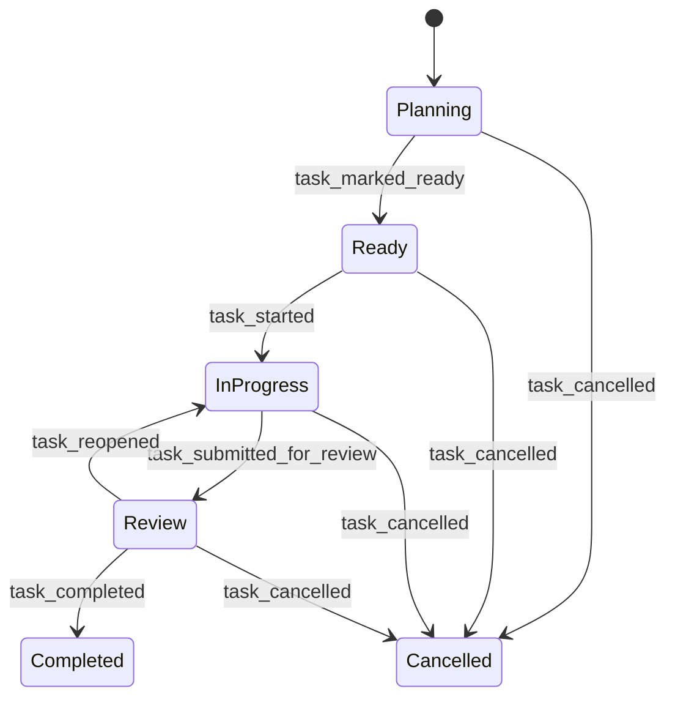

# AI Dev Control Plane 落地路线图

后续设计与实现必须遵守：[ARCHITECTURE_GUARDRAILS.md](./ARCHITECTURE_GUARDRAILS.md)。

## 总原则

能力进入系统的顺序必须是：

```text
可表达 -> 可校验 -> 可审计 -> 可隔离 -> 可执行 -> 可并发
```

不能跳级。边界优先于自动化程度，确定性优先于智能程度。

第一版产品停在 `M3 Manual 闭环 MVP`。它不依赖模型，也已经能用于真实任务治理。`M4` 以后必须根据 dogfood 结果决定是否继续。

## 信任模型

默认假设：

```text
agent 输出不可信
仓库文本、网页和 MCP 返回值可能包含 prompt injection
adapter 和 MCP server 默认不可信
control CLI 是 trusted computing base
模型不能自行决定授权
telemetry 是 evidence，不是真相
```

一句话分工：

```text
prompt 负责提出动作
policy 负责判断动作
sandbox 负责限制动作
event log 负责解释动作
```

`worktree` 用于隔离变更和降低冲突，不是安全边界。`MCP roots` 用于提示范围，也不是访问控制。真正的强制边界必须由控制层 policy 与 sandbox 执行。

## 受控执行协议

OMP dogfood 证明，仅限制工具调用不足以约束模型行为。控制层还必须约束授权、审计与完成声明：

```text
结构化 proposal
  -> pending_approval
  -> scoped lease
  -> implement
  -> audit_hold
  -> deterministic audit
  -> human_resume | completed | stopped
```

协议原则：

- proposal 声明 milestone、objective、allowed paths、schema 变化、依赖变化、required gates 和禁止变化。
- 人类批准结构化 proposal 后，控制层才生成绑定 task、run、资源、动作、TTL 和最大使用次数的 lease。
- scope 扩大必须生成新的 proposal，不能由模型自行推断。
- 审计触发器命中后立即进入 `audit_hold`。该状态只能运行只读检查和允许模板内的离线 gate。
- `ASK`、`STOP` 与 `UNVERIFIED` 是合法终态，不会因为模型被要求“持续完成任务”而自动绕过。
- completion interlock 独立检查证据、baseline 回退与未决审批。模型和 reviewer 都不能自行宣布完成。

自动 reviewer 只在后续 adapter 协议稳定后接入。它是额外 sensor，不是事实源，也不是机器 gate 的替代品。

## 事实模型

```text
events.jsonl     = append-only canonical truth
telemetry.jsonl  = append-only evidence index
task.json        = 由 replay 重建的任务投影视图
control.json     = 由 reconcile 重建的决策投影视图
artifacts/       = 被 hash 引用的不可变证据
Markdown         = 人类可读解释，不参与状态判断
```

外部执行器不能直接追加 canonical event。agent、adapter 和人工工具只能提交 evidence，由控制层验证后生成事件。

`MVP` 只做一个 aggregate：`Task`。`AgentRun`、worktree 和 telemetry 先保留引用字段，出现并发执行需求后再拆分。

## Task 状态模型



`hold` 与 `archived` 不进入 phase：

- `hold` 是正交状态：越界、gate 失败、等待审批或人工暂停都可以触发。
- `archived` 是存储属性：终态任务归档后仍然保留 `completed` 或 `cancelled` 语义。
- `boundary_violation_recorded` 必须同时记录越界并进入 hold，避免崩溃后继续执行。

关键不变量：

| 操作 | 前置条件 |
|---|---|
| `ready` | objective、scope、至少一个 gate 合法 |
| `start` | phase 为 `ready`，没有 hold |
| `submit` | phase 为 `in_progress`，没有 hold |
| `finish` | phase 为 `review`，所有 required gate 最新结果通过，没有 hold |
| `archive` | phase 为 `completed` 或 `cancelled` |
| `revise` | MVP 只允许 phase 为 `planning` |

## MVP 数据结构

### EventEnvelope

```text
schema
event_id
command_id
task_id
seq
occurred_at
actor
type
payload
```

### TaskDefinition

```text
schema
id
mode
objective
baseline_commit
read_scope
write_allow
write_deny
risk_triggers
gates
```

### PolicyDecision

```text
allowed
rule_ids
diagnostics
approval_required
```

### Assignment

```text
id
task_id
adapter
contract
scopes
context_hashes
required_capabilities
acceptance
```

### Evidence

```text
run_id
source
command
exit_code
touched_files
input_hashes
output_hashes
```

所有边界对象使用 JSON Schema Draft 2020-12，默认关闭未知字段：

```json
{"unevaluatedProperties": false}
```

## 里程碑

### M0：边界协议冻结

**用户价值**

团队知道系统承诺什么、不承诺什么。先冻结协议，再写执行器。

**交付内容**

```text
schemas/
  control.task-definition.v1.schema.json
  control.event-envelope.v1.schema.json
  control.task-view.v1.schema.json

ctl schema validate
ctl boundary check
ctl boundary explain
ctl architecture check
```

定义：

- `TaskDefinition`、`Scope`、`Gate`、`EventEnvelope`。
- 事件表、状态转换表和 reducer fixtures。
- 路径规范化规则：Windows 大小写、分隔符、绝对路径、`..`、symlink、junction、UNC。
- 默认拒绝和 hard forbid 规则。
- proposal、scoped lease、`audit_hold`、completion interlock 与 baseline manifest 的协议。
- 固定审计矩阵及 `PASS / ASK / STOP / UNVERIFIED` 判定规则。
- proposal、approval、scoped lease、assignment、evidence、audit report、completion interlock 与 drift report 的最小 schema 方案；本阶段只冻结文档设计，不修改 `schemas/**`。

**退出条件**

- 合法 fixture 通过 schema 校验。
- 未知字段、缺少 gate、非法状态转换被拒绝。
- `..`、绝对路径、symlink、junction、UNC 和 root 外路径被拒绝。
- 相同事件流始终生成相同 `task.json`。
- hard forbid 不能被 permit 或 approval 覆盖。
- 测试、fixture、schema 或 required gate 数量下降时触发 baseline 回退并停止。
- 审计触发后进入只读 `audit_hold`，未通过 completion interlock 时不能生成完成事件。
- 固定审计矩阵至少覆盖 schema 反例、非法状态转换、replay、Windows 路径逃逸、受保护文件、依赖和 required gate 变化。

**暂不做**

有副作用的执行器、真实工作区 diff 集成、自动 reviewer、agent、telemetry 评分、drift 自动化、网络访问。

### M1：本地任务账本

**用户价值**

可以稳定记录任务生命周期，并在中断后恢复。

**命令**

```text
ctl init
ctl task create
ctl task revise
ctl task ready
ctl task start
ctl task status
ctl task cancel
ctl replay
ctl validate
ctl doctor
```

**实现约束**

- `events.jsonl` 是唯一可追加领域事实。
- `task.json` 只能由 reducer 生成，禁止人工或 agent 写入。
- 每条事件拥有严格递增的 `seq` 和幂等 `command_id`。
- reducer 不访问时间、Git、文件系统或网络。
- 写视图使用临时文件和原子替换。

**退出条件**

- 临时 Git 仓库内可以跑通创建、ready、start、cancel 生命周期。
- 删除 `task.json` 后可以仅依赖 `events.jsonl` 恢复。
- 重复 replay 输出字节级一致。
- 缺失、重复和损坏事件被拒绝，不静默修复。
- 归档终态之外的任务不能归档。

**暂不做**

上下文 manifest、gate 执行、adapter、并发 append。

### M2：验收、边界与归档

**用户价值**

任务可以明确声明“允许修改什么”，并且在完成前接受机器验收。

**命令**

```text
ctl context build
ctl boundary check
ctl boundary explain
ctl gate run
ctl gate record
ctl task submit
ctl task reopen
ctl task finish
ctl task archive
ctl reconcile
```

**实现约束**

- M0 的协议级 `boundary check / explain` 在此接入真实工作区 diff、上下文 manifest 和任务生命周期。
- `finish` 自动执行 scope check、required gates、事件追加和视图折叠。
- `baseline_commit` 与任务启动前脏工作区快照分开记录，避免误判。
- `.git/**`、策略文件、gate 定义、canonical events 默认禁止写入。
- gate runner 明确命令模板、工作目录、环境变量、超时与日志脱敏。
- `boundary_violation_recorded` 自动进入 hold。

**退出条件**

- 越界修改能够被拦截，并输出命中规则、证据和解除方式。
- gate 未通过时无法 finish。
- agent 自述或伪造 telemetry 不能直接完成任务。
- 归档冲突可检测，重复归档具备幂等语义。
- `small` 任务从创建到归档可以在真实仓库使用。

**暂不做**

自动 agent 执行、策略 runtime、任意 shell、依赖自动安装。

### M3：Manual 闭环 MVP

**用户价值**

不接任何模型，也能把 AI 开发任务变成可声明、可审计、可验收的受控过程。

**命令**

```text
ctl assignment create
ctl assignment export
ctl run ingest --adapter manual
ctl audit
ctl report
```

**实现约束**

- `manual` 是第一个正式 adapter，不是临时兜底。
- 人或任意 AI 工具读取 `assignment.json`，工作后提交 `agent-output.json`。
- 控制层独立检查实际 diff、gate 和证据 hash。
- `assignment.json` 和 `agent-output.json` 是后续 OMP adapter 的 contract test 基线；自动执行器不得另建隐式协议。
- `small / medium / large` 是风险控制级别，不只是文档数量选项。
- 允许显式升级模式，禁止静默降级。

**退出条件**

- 从任务创建、assignment export、人工执行、output ingest、gate 到归档端到端通过。
- 中断后 `control status` 可以恢复上下文。
- evidence 包含输入、输出、命令和文件 hash。
- 重放后 audit 结论一致。
- 使用 M3 完成至少 10 个真实 small 任务。

**暂不做**

OMP 调用、多智能体、连续 drift 分数、daemon、数据库。

### M4：OMP 单执行器隔离运行

**用户价值**

OMP 可以执行单个 assignment，同时守住主工作区边界。

**命令**

```text
ctl adapter capabilities omp
ctl workspace create
ctl workspace diff
ctl workspace apply
ctl run start --adapter omp
ctl approval request
ctl approval grant
ctl approval deny
```

**实现约束**

- OMP 只在 disposable worktree 中写入。
- worktree diff 必须经过 apply gate，不能直接进入主工作区。
- 越界 diff 永远不能 apply。
- 删除、依赖变化、Git 操作、网络访问、公共 API 和安全策略变化需要 step-up approval。
- approval 只能批准结构化 request，不能批准一句自然语言。
- lease 绑定 task、run、资源、动作、TTL 与最大使用次数。
- OMP adapter 必须映射通用的 `proposal -> lease -> implement -> audit_hold` 协议，不能另建一套隐式授权状态。
- 自动 reviewer 可以提交 review evidence，但 completion interlock 仍由控制层执行。

**退出条件**

- OMP 中断后可以恢复或明确失败。
- 越界 diff、过期 lease、跨任务 lease 和重复 lease 全部拒绝。
- 高风险变更未经 approval 不能 apply。
- 至少用 M3/M4 完成 20 个真实任务，再决定是否进入 M5/M6。

**暂不做**

并发写入、自动合并、其他执行器 adapter、长期密钥注入。

### M5：可解释控制闭环

**用户价值**

系统可以回答“为什么继续、暂停或重规划”。

**命令**

```text
control telemetry add
control drift compute
control drift explain
control next-action
```

**实现约束**

- drift 首先使用透明规则，不使用模型自由打分。
- 相同 evidence 和规则必须生成相同决策。
- 未知信号默认不能放宽权限。
- drift 升高只能触发暂停或重规划，不能自动扩权。
- `replan` 和 `rescope` 只生成结构化 proposal，并停止当前执行；不得自动修改 scope、批准 lease 或启动新任务。

**退出条件**

- Golden fixtures 对应固定动作。
- 每次决策列出信号、规则 ID 和 evidence。
- `control.json` 可以由 reconcile 重建。

**暂不做**

模型评分、dashboard、OpenTelemetry Collector、自动重规划执行。

### M6：受限多智能体

**用户价值**

在写入范围不重叠的前提下安全并行，提高吞吐量。

**命令**

```text
ctl schedule plan
ctl schedule validate
ctl schedule run
control agent report
ctl workspace merge-candidate
```

**实现约束**

- 这时再拆出独立 `AgentRun` aggregate。
- 每个写入 agent 使用独立 worktree 和 capability lease。
- 每个写入 agent 必须有独立 scoped lease；lease 的 write scope 不能与其他写入 agent 重叠。
- 重叠写 scope 必须拒绝。
- 只读任务可以并发。
- 合并候选仍需人工确认。

**退出条件**

- 重叠写入被拒绝。
- 崩溃恢复不会重复执行副作用。
- 共享 `.git` 风险有明确防护。
- 脏工作区和合并冲突可以恢复。

**暂不做**

全自动 merge、commit、push、deploy、动态扩权和多厂商并发。

## 子代理审核门（硬层，设计冻结）

软层已先行落地：control-guard 指挥主代理在「申请编辑」和「任务完成」时派只读 `ctl-review`
子代理审核/审计，靠约定与 `explore` 只读放行生效。下列硬层把它从「约定」升级为「网关强制」，
**顺序是先修治理基座、再上强制审核门**——每条都依赖前一条。本节为设计，未启用。

### M-a：网关多活动任务治理（强制审核门的前置）

**问题**：`compute_gov_state`（`src/cli/mod.rs`）遇到第一个 `in_progress` 任务即 early-return；
多个任务同时活动时，其余在网关层静默失管。并发子代理审核会制造多活动任务，不修则强制门名存实亡。

**方向**：网关按「派发该工具调用的那个任务」绑定治理（见 M-e），或在存在多活动写入任务时显式拒绝。
与 M5（reconcile）的活动任务集合定义对齐。

### M-b：control.json + `ctl board`

**用户价值**：跨任务集中视图。reconcile 投影 `control.json`（AGENTS.md 预留，M5+），
`ctl board` 按 phase / hold / active / gate / 审核裁决聚合全部任务。审核裁决数据来自软层的
verdict→evidence 事件。

### M-c：跨任务影响接入网关

**方向**：「申请编辑」时调用现有 `src/application/schedule.rs::detect_write_scope_overlap`，
本次写入若撞上其他活动任务的 `write_allow` 则硬拒；补全当前为桩的 `ctl schedule validate` /
`ctl schedule run`。

### M-d：跨任务依赖边

**方向**：在调度现有的互斥分组之上增加「A 先于 B」的依赖关系（恢复 Trellis parent/child 的能力），
依赖写入任务声明而非靠树位置隐含。

### M-e：子代理↔任务绑定

**方向**：可写子代理按「派发它的那个任务」的 `write_allow` 受治，而非网关扫描第一个活动任务；
与 M6 `AgentRun` aggregate 和 capability lease 对齐。

### M-f：硬版审核门

**命令**

```text
ctl apply --path <p>      # 越界编辑申请，记录 reviewer 裁决为事件
ctl task finish           # 联锁：要求存在通过的完成审计裁决事件
```

**依赖**：M-a（多活动任务治理）+ M-e（子代理绑定）。在两者就绪前，审核门只能停留在软层。

## Dogfood Workflow

最早验证路径：

```powershell
ctl init
ctl task create --mode small --title "fix config parsing" `
  --scope src/config.rs --gate "cargo test"
ctl task ready
ctl task start
ctl context build
# 人或任意 AI 工具完成修改
ctl task submit
ctl task finish
ctl task archive
control status
```

体验标准：

- 30 秒内创建并启动一个 small 任务。
- 同一仓库默认只有一个 active task，减少反复输入 ID。
- 每个成功命令输出建议的下一步命令。
- `control status` 给人看，`control status --json` 给脚本和 adapter 看。
- 所有写操作支持 `--dry-run`。
- 拒绝操作时输出命中的边界、证据和解除方式。

## 禁止过早进入自动路径

```text
write_code_any
任意 shell
自动扩权
自动安装依赖
无限制网络
长期密钥注入
自动 commit / push / merge / deploy
数据库迁移
公共 API 与安全策略自动变更
多个 agent 并发写同一文件
未经 wrapper 的 MCP tool 透传
让 agent 修改 gate、policy、canonical event
```

## 开工前要钉死的决策

1. 路径规范化：Windows 大小写、反斜杠、glob、symlink、junction、UNC 和仓库外路径。
2. 事件持久化：文件锁、`seq`、`command_id`、checksum、`fsync`、原子替换和崩溃恢复。
3. 脏工作区归因：任务启动前已有修改如何记录。
4. Gate 安全模型：是否允许命令模板之外的 shell，如何限制环境变量、子进程和超时。
5. 状态迁移：是否允许归档后恢复，审批 hold 如何解除。
6. Adapter 协议：版本化 JSON stdin/stdout、timeout、cancel、retry 和幂等键。
7. 任务 ID：时区、同名冲突、归档目录冲突。
8. 模式升级：用户可显式选择；系统只能建议升级，不能静默降级。
9. Capability lease：资源表达、TTL、`max_uses`、撤销与过期进程终止。
10. 许可证隔离：哪些内容只吸收思想，哪些模板可能构成复制。
11. 审计协议：触发器、`audit_hold`、允许的只读 gate、恢复事件和 completion interlock。
12. Baseline manifest：稳定检查项、回退判定、显式升级与人工解除方式。

## 短期不引入

```text
Temporal server
数据库或 daemon
Cedar / OPA runtime
OpenTelemetry Collector
Vault
完整 in-toto 签名链
Codex / Claude / OpenCode adapter
```

先把字段、事件、trait 和 enforcement point 留出来。只有真实需求出现后，再接入对应能力。
