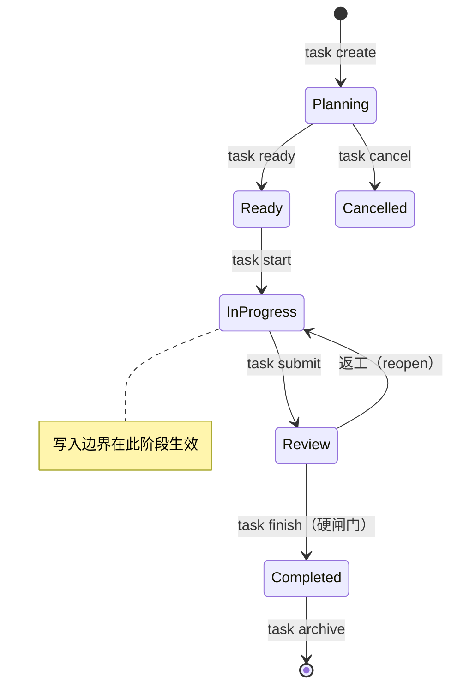

# ctl 使用说明（面向人）

> 这份文档是 **ctl 的完整使用手册**。如果你只想要 30 秒上手，看 [README.md](./README.md) 的「快速开始」；本文讲清楚每个概念、每条命令、每个常见场景。
>
> 设计原理（控制论闭环、drift、schema）见 [DESIGN.md](./DESIGN.md)；架构红线见 [ARCHITECTURE_GUARDRAILS.md](./ARCHITECTURE_GUARDRAILS.md)。
> **如果你是 AI agent**，直接看 [AGENT_GUIDE.md](./AGENT_GUIDE.md)——那是一份专门给你的操作指南。

---

## 目录

- [核心概念](#核心概念最小必要)
- [安装与初始化](#安装与初始化)
- [任务全生命周期](#任务全生命周期)
- [写入边界](#写入边界)
- [验收闸门（gate）](#验收闸门gate)
- [看板与诊断](#看板与诊断)
- [更新与升级](#更新与升级)
- [常见场景](#常见场景)
- [命令速查表](#命令速查表)

---

## 核心概念（最小必要）

理解这五件事，就理解了 ctl 的全部：

**1. 任务（Task）是有状态机的单位。** 一次 feature、bugfix、refactor 或研究都是一个任务，带明确的目标、可读范围、可写范围和验收闸门。状态机：



`approve` 是「人工专用的 ready」（等价于 ready，但语义上标记「人来放行」）。`hold` 不是一个独立命令——违反边界、gate 失败或人工暂停会自动把任务置为 held，held 期间禁止 `start`/`submit`/`finish`。

**2. 事件溯源（event sourcing）是唯一事实模型。** 每个任务的 `.ctl/tasks/<id>/events.jsonl` 是 **append-only 的唯一事实源**；`task.json`（任务投影）和 `control.json`（看板投影）都是从事件 replay 出来的，**随时可删重建，绝不手改**。外部角色（agent、adapter、人）**不能直接追加 canonical event**，只能提交 evidence，由控制层验证后才生成事件。

**3. 写入边界是 fail-closed 的。** 每个任务声明 `write_allow`（可写路径）；越界写入被宿主 hook **当场拦截而非放行**。`ctl` 不可用时，路径作用域的写工具（Write/Edit/MultiEdit）也 fail-closed——边界绝不静默放行。

**4. 验收闸门（gate）是机器可执行的。** gate 是**固定模板**（无任意 shell），只有 gate 通过才允许 `in_progress → review → completed` 推进。「我觉得做完了」不算数。

**5. 认识状态层（V1）只记录与披露，不验证。** brainstorm / uncertainty / research 记录的是「哪些产物发生过、哪些未知被何种证据关闭」，**不是**「思考有质量」或「结论正确」。详见 [EPISTEMIC_CONTROL.md](./EPISTEMIC_CONTROL.md)。

> **诚实声明：** 写入边界是 **agent 工具 hook 层的拦截，不是 OS 沙箱**。它治理经 hook 路由的写操作；不经 hook 的进程不受约束。事件日志**不是 L3 防篡改证据**（无签名/无 hash chain）。完整的边界与信任声明见 README「工作原理」与 [EPISTEMIC_CONTROL.md](./EPISTEMIC_CONTROL.md)。

---

## 安装与初始化

安装、验证、平台初始化的完整步骤见 [README.md](./README.md) 的「快速开始」。要点：

```bash
ctl --version          # 确认安装（应输出 ctl 0.0.15）
ctl init --claude --omp   # 在项目根配置你要接入的 AI 平台（可多选）
ctl doctor             # 初始化后跑一次，诊断账本/集成健康
```

`ctl init` 支持 `--claude` / `--opencode` / `--omp` / `--all` / `--yes`，以及 `--platform <name>` 重复指定多平台。它会在项目里创建 `.ctl/` 任务账本、写入默认配置、注入所选平台的治理 hook/skill/settings。

---

## 任务全生命周期

下面是**手动驱动**一个任务的完整流程（日常协作里这一整套通常由 AI agent 经内置 skill 自动跑，见 [AGENT_GUIDE.md](./AGENT_GUIDE.md)；这里讲底层命令便于理解机制）。

### 创建：`ctl task create`

```bash
ctl task create \
  --id 06-14-fix-login \
  --objective "修复登录态过期" \
  --read-scope src \
  --write-allow src/auth \
  --write-deny src/auth/legacy \
  --gates cargo_test \
  --depends-on 06-10-auth-refactor
```

| 字段 | 含义 |
|---|---|
| `--id` | 稳定标识，映射到 `.ctl/tasks/<id>/` |
| `--objective` | 任务目标（一句话） |
| `--read-scope` | 可读路径（**必填**，可重复） |
| `--write-allow` | 可写路径（**必填**，可重复）——这是写边界，**从最小开始** |
| `--write-deny` | 额外禁止写的路径（可重复） |
| `--gates` | 验收闸门模板 id（可重复；省略则用项目默认 floor） |
| `--depends-on` | 必须先完成的前置任务（可重复） |
| `--kind` | `implementation`（默认）或 `research`（研究类任务，见下） |

> 想调整一个**还在 Planning** 的任务边界，用 `ctl task revise --id <id> ...`，省略的字段保持原值。任务一旦 `ready` 就不能再用 `revise` 改边界——要加宽得走 [`ctl apply`](#越界写ctl-apply) 申请受审例外。

### 快捷：`ctl task quick`

小改动可以一步到位（等价于 create + ready + start）：

```bash
ctl task quick --write-allow src/auth --objective "修复登录态过期" --gates cargo_test
```

### 推进状态

```bash
ctl task ready   --id 06-14-fix-login   # Planning → Ready
ctl task approve --id 06-14-fix-login   # 人工专用 ready（标记「人来放行」）
ctl task start   --id 06-14-fix-login   # Ready → InProgress，写入边界开始生效
# … 在 src/auth 内实现 …
ctl gate run --id 06-14-fix-login --gate cargo_test   # 跑验收闸门，记录 evidence
ctl task submit  --id 06-14-fix-login   # InProgress → Review
```

### 审计与完成（硬闸门）

```bash
# 完成审计：reviewer 必须 ≠ implementer（用 CTL_ACTOR 区分角色）
CTL_ACTOR=ctl-review ctl review accept --id 06-14-fix-login --note "build/test 通过，diff 在边界内"
ctl task finish  --id 06-14-fix-login   # Review → Completed（硬闸门，见下）
ctl task archive --id 06-14-fix-login   # 归档
```

**`ctl task finish` 是硬闸门**，必须同时满足三条才会放行：

1. **新鲜的通过审计**——在最近一次 `submit` 之后记录的 `ctl review accept`（自己不能给自己记 passing 审计；上一轮的 pass 在重新 submit 后失效，返工后要重新审计）；
2. **新鲜的 gate evidence**——绑定到当前代码树的 gate 通过记录；
3. **干净的工作树**。

如果 finish 报「stale evidence」，就重跑 gate、重新审计：

```bash
ctl gate run --id 06-14-fix-login --gate cargo_test   # 重跑需要的 gate
CTL_ACTOR=ctl-review ctl review accept --id 06-14-fix-login --note "..."
ctl task finish --id 06-14-fix-login
```

### 中止与查看

```bash
ctl task status  --id 06-14-fix-login   # 查看当前投影
ctl task cancel  --id 06-14-fix-login   # 取消一个未终结的任务 → Cancelled
```

### 规范顺序（务必遵守）

**submit →（在 Review 阶段：记录通过审计 + 提交边界内改动）→ finish → archive。** 不要跳阶段（例如 Planning 直接到 InProgress 而不经 Ready）。

---

## 写入边界

**原则：`write_allow` 永远从最小开始**，只在明确批准后加宽。

**受保护路径永远禁止写**（硬拒，observe mode 也不放行）：`.git/`、`.ctl/tasks/*/events.jsonl`、`schemas/`、`Cargo.toml`、`Cargo.lock`、`.control` 等。**绝不要手改 `events.jsonl` 或 `task.json`**（append-only 事实源 / replay 投影）。

### 越界写：`ctl apply`

确实需要写到 `write_allow` 之外时，**不要直接放开**，而是申请一个受审的路径例外：

```bash
ctl apply --id 06-14-fix-login \
  --path src/config.rs \
  --reason "登录修复需要改一处配置读取" \
  --ttl 86400
```

这会归档一个路径作用域的 approval；经 `ctl-review`（模式 A）通过后，gate 才允许对该**单一路径**的越界写。

### 边界自检：`ctl boundary`

```bash
ctl boundary check   --path src/auth/login.rs    # 校验某次写入是否越界
ctl boundary explain --path src/auth/login.rs    # 解释为什么被接受/拒绝
```

`explain` 在排查「路径看起来在 write_allow 内却被拒」时最有用——多半是 `..`/绝对路径/UNC，或落在了受保护路径上。

### Observe mode（宿主 gate hook 的行为）

宿主写 gate（`ctl hook gate`）默认跑在 **observe mode**：一个越界或无任务的变更**被允许但被记录**到非 canonical 的 `.ctl/decisions.jsonl`，并给模型一条可见的 warning。**warning 是提示你去创建/加宽任务，不是继续无治理的许可。** 即便在 observe mode，下面这些**硬核仍然拒绝**：受保护路径、依赖变更（需 step-up 审批）、held 任务、跨任务写重叠。

> 用 `ctl decisions` 查看这些观察记录（见[看板与诊断](#看板与诊断)）。它是变更故事的一部分——完成审计会回看任务窗口内的 observe 记录。

### 边界的诚实声明（重要）

- **写工具 vs Bash**：路径作用域的 Write/Edit/MultiEdit 是 fail-closed 的硬边界。但 **Claude Code 的 Bash 在 `ctl` 出错/超时时 fail-open**（绝不锁死 shell），且 bash 不做路径作用域检查——所以**范围内修改优先用 Write/Edit**，别绕道 bash。
- **子 agent 派发**：Claude Code 的 `Task`/子 agent 派发**不被 PreToolUse 门禁匹配**（平台边界）。规则：**只派发只读研究类子 agent，写操作留在主 agent**（详见 [.claude/subagent-dispatch.md](./.claude/subagent-dispatch.md)）。OMP / opencode 的 `task` 派发经会话级插件门禁。
- 边界是机制护栏，**不是密码学安全边界**。

---

## 验收闸门（gate）

gate 是固定模板（无任意 shell）。**内置模板**：

| 语言 | 模板 id |
|---|---|
| Rust | `cargo_check`、`cargo_test`、`cargo_fmt_check`、`cargo_clippy` |
| TypeScript/Node | `tsc_check`、`eslint_check`、`vitest_run` |

内置 id 是保留的；项目自定义 gate 用 `.ctl/config.toml` 里的 `[[gate]]` 扩展（同样的 `{command, args}` 形状），与内置同源。目前**没有**「列出已注册模板」的子命令——内置模板见上表，项目自定义 gate 读 `.ctl/config.toml` 的 `[[gate]]` 段。

```bash
ctl gate run    --id <id> --gate cargo_test   # 执行 gate，结果记为 canonical event
ctl gate record --id <id> --gate cargo_test ... # 记录一个外部已验证的 gate 结果
```

每个任务的 gate 默认值可省略——省略 `--gates` 时回退到项目默认 floor（`.ctl/config.toml` 里 `[project].default_gates`，通常由 `/ctl-spec` 记录）。

> gate runner 会执行命令并记录 evidence；一个**超时** gate 的进程树会被终止，不会挂住 supervisor。

---

## 看板与诊断

```bash
ctl board                       # 终端 Kanban（默认）
ctl board --active              # 只看未归档任务
ctl board --table               # 传统表格
ctl board --json                # 机器可读
ctl board --include-archived    # 含已归档
```

诊断命令（**都是只读的**，安全）：

```bash
ctl doctor                 # 账本健康：投影漂移、孤儿 run、schema 校验失败等
ctl adapter doctor         # 平台集成：hook/skill/插件是否就位
ctl adapter doctor --verify   # 额外跑 opencode Bun 插件测试
ctl adapter list           # 列出注册表里全部 adapter 及能力
ctl adapter status --adapter opencode   # 诊断单个 adapter

ctl decisions              # 看 observe mode 记录的越界/无任务变更（.ctl/decisions.jsonl）
ctl decisions --limit 100  # 最近 100 条
```

**M5 可解释控制环**（基于 telemetry evidence 的确定性 drift 规则）：

```bash
ctl drift explain --id <id>     # 解释一个 drift 决策：信号、规则 id、证据
ctl next-action --id <id>       # 建议下一步：pass / ask / stop / replan / rescope（只读、advisory）
ctl next-task                   # 建议下一个该 ready/start 的任务（按依赖/drift/无冲突排序）
```

**投影与修复**：

```bash
ctl replay                   # 重建所有 task.json 投影（指定单个：--task <id>）
ctl reconcile                # 重建全部任务视图（写 .ctl/control.json）
ctl validate                 # 校验 canonical 事件流
ctl repair --all             # 预览修复撕裂/不一致的账本（加 --apply 才真改）
ctl repair --cross-ledger    # 检测并（--apply）修复 task↔run 跨账本不一致
```

> `ctl` 永远不自动改写状态——`doctor`/`repair` 报告问题并给出手工恢复指引，是否动手由你决定。

---

## 更新与升级

```bash
ctl update --merge           # 同步项目内的 ctl 模板（安全合并，保留你的本地定制）
ctl update --merge --force   # 强制覆盖本地改过的托管文件
ctl update --merge --skip    # 跳过本地改过的托管文件

ctl self-update              # 原地升级 ctl 二进制到最新 release
ctl self-update --check      # 只检查是否有新版本
```

> 注意：不带 `--merge` 的 `ctl update` 是**遗留的二进制自更新**（等同 `ctl self-update` 的旧行为）。**同步项目模板一律用 `ctl update --merge`。** `ctl self-update` / `ctl update` 是 ctl 唯一做网络 I/O 的命令（出口见 [ADR 0002](./docs/adr/0002-allow-narrow-network-egress-for-ctl-update.md)）。

---

## 常见场景

### 场景 1：一处小修

直接改（gate 会以 observe mode 记录这次无任务写入），或用一个 quick 任务留痕：

```bash
ctl task quick --write-allow src/utils.rs --gates cargo_check
```

### 场景 2：多文件 feature

不要手动一条条敲——走治理管线（grill → PRD → tasks），由 AI agent 经 skill 驱动。流程见 [AGENT_GUIDE.md](./AGENT_GUIDE.md)。人这一侧你只在「确认边界」「确认归档」等节点介入。

### 场景 3：必须越界写

用 [`ctl apply`](#越界写ctl-apply) 申请受审的路径例外，**不要**直接改 `write_allow` 把范围扩到根。

### 场景 4：账本看起来不一致

```bash
ctl doctor              # 看报告：drift / 孤儿 / 损坏 + 手工恢复指引
ctl repair --all        # 预览修复（--apply 才执行）
```

### 场景 5：研究 / Spike（产出是证据，不是代码）

```bash
ctl task create --id research-x --kind research --objective "验证 X 是否可行" \
  --read-scope . --write-allow brainstorms/research-x --gates cargo_check
# … 调查、跑实验 …
ctl research record --id research-x --kind findings --artifact brainstorms/research-x/findings.md
ctl uncertainty dispose --id research-x --uncertainty U-001 --disposition resolved --evidence-ref E-001
```

研究类任务以「证据 + 不确定性了结」完成，而非 diff。

---

## 命令速查表

```text
# 任务生命周期
ctl task create  --id <id> --objective <t> --read-scope <p> --write-allow <p> [--write-deny <p>] [--gates <g>] [--depends-on <id>] [--kind implementation|research]
ctl task quick   --write-allow <p> [--objective <t>] [--gates <g>]           # create+ready+start
ctl task revise  --id <id> [--write-allow <p>] [--gates <g>] ...              # 仅 Planning 任务
ctl task ready|approve|start|submit|finish|archive|status|cancel --id <id>

# 验收
# gate 模板 = 内置（cargo_*/tsc_*/eslint/vitest）+ .ctl/config.toml 的 [[gate]]；无 list 子命令
ctl gate run    --id <id> --gate <g>
ctl gate record --id <id> --gate <g> ...

# 审计（reviewer ≠ implementer，用 CTL_ACTOR 区分）
CTL_ACTOR=<reviewer> ctl review accept --id <id> [--note <t>]
CTL_ACTOR=<reviewer> ctl review reject --id <id> --note <t>

# 边界
ctl boundary check   --path <p>
ctl boundary explain --path <p>
ctl apply --id <id> --path <p> --reason <t> [--ttl 86400]     # 申请越界例外

# 看板与诊断（只读）
ctl board [--table|--active|--include-archived|--json]
ctl doctor | ctl adapter list | ctl adapter doctor [--verify] | ctl adapter status --adapter <n>
ctl decisions [--limit N] [--json]
ctl next-action --id <id> | ctl next-task | ctl drift explain --id <id>

# 投影与修复
ctl replay [--task <id>] | ctl reconcile | ctl validate
ctl repair [--all|--task <id>|--run <id>] [--cross-ledger] [--apply]

# 认识状态层（V1，record-and-disclose，不门禁/不评分）
ctl brainstorm record|attach-critic|skip-critic|show  --id <id> ...
ctl uncertainty record|evidence|dispose|status        --id <id> ...
ctl research    record|status                         --id <id> ...
ctl dispatch    record|list                           --task <id> ...
ctl handoff     export --id <id> | capture --id <id> --file <json>

# 更新
ctl update --merge [--force|--skip]     # 同步项目模板
ctl self-update [--check]               # 升级二进制
```

> 完整子命令与每个 flag 以 `ctl --help` / `ctl <cmd> --help` 为准。

---

## 去哪找更多

| 想了解 | 看 |
|---|---|
| AI agent 怎么用 ctl | [AGENT_GUIDE.md](./AGENT_GUIDE.md) |
| 控制论闭环、drift、schema 设计 | [DESIGN.md](./DESIGN.md) |
| 认识状态层、四级信任、不确定性本体 | [EPISTEMIC_CONTROL.md](./EPISTEMIC_CONTROL.md) |
| 架构红线（必守） | [ARCHITECTURE_GUARDRAILS.md](./ARCHITECTURE_GUARDRAILS.md) |
| 里程碑与退出条件 | [ROADMAP.md](./ROADMAP.md) |
| 用 OMP `/glob` 分阶段推进 | [GLOB_WORKFLOW.md](./GLOB_WORKFLOW.md) |
